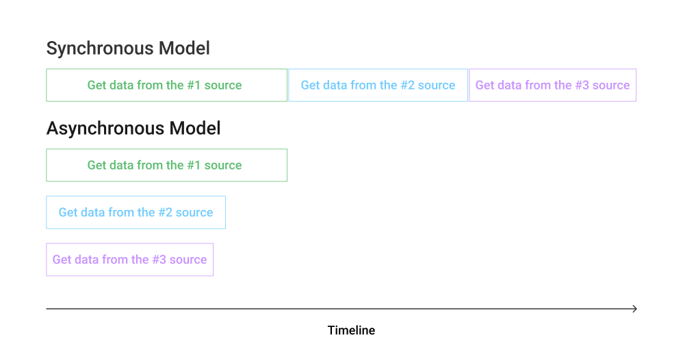

Asynchroniczność to koncept niełatwy do zrozumienia i jeszcze trudniejszy do dobrego zaimplementowania. Mimo tych trudności asynchroniczność jest dziś wszechobecna i trzeba ją znać.

Napisana w poprawny sposób jest w stanie podnieść wydajność naszej aplikacji, jednak to obosieczny miecz. Asynchroniczne rozwiązania mogą doprowadzić do trudnych do znalezienia błędów, w tym związanych z...obniżeniem wydajności. Coż za ironia!

Jednak czym asynchroniczność właściwie jest?

## Nie pozwól procesorowi czekać

Wróćmy do podstaw związanych z przetwarzaniem naszego kodu. Zajmuje się tym procesor, który (bez zagłębiania się w szczegóły) wykonuje nasz program krok po kroku, czy właściwie linijka po linijce. **Jest on bardzo szybki** i większość operacji takich jak iteracja w pętli czy dodanie dwóch liczb może być wykonana w całości przez procesor.

Jednak wiele programów współdziała z rzeczami poza procesorem, przykładami są:

- odczyt danych z dysku
- komunikacja przez sieć

Operacje te są **o wiele wolniejsze** od procesora, dlatego warto w momencie ich wykonywania pozwolić procesorowi przejść do następnych kroków, a kiedy ta powolna operacja zakończy się, poinformować go o tym. Jednak jak doprowadzić do takiej sytuacji w naszym kodzie?

## Synchroniczność vs Asynchroniczność

W programowaniu wyróżniamy **model synchroniczny** w którym każdy z kroków wykonywany jest pojedynczo oraz **model asynchroniczny**, który umożliwia wykonywanie wielu operacji jednocześnie.

W przypadku powolnej operacji (takiej jak zapytanie do serwera) program w modelu asynchronicznym nie czeka na jej zakończenie, tylko wykonuje następne kroki. W momencie zakończenia tej operacji program jest o tym informowany i uzyskuje dostęp do jej wyniku (np. danych z serwera). Dzięki temu zyskujemy czas.



## Asynchroniczności w Javascript

### Callbacks

W Javascript rozwiązania asynchroniczne były długo realizowane tylko za pomocą `callback'ów`, czyli zwykłych funkcji, które wywoływały się w momencie zakończenia określonej operacji. Prosty przykładem, może być `setTimeout`, który wywoła funkcje po upłynięciu określonego czasu.

```javascript
setTimeout(() => console.log("I'm calling after 1 second"), 1000);
```

W czasie kiedy strony ograniczały się do podstawowych interakcji z użytkownikiem, a o "aplikacjach internetowych" nikt nie słyszał, było to wystarczające.

Z czasem do przeglądarek przenoszono coraz więcej logiki, miało to odzwierciedlenie również w kodzie asynchronicznym i `callback'ach`.

Zaczęto je w sobie zagnieżdzać co znaczenie pogarszało czytelność kodu oraz wydłużało czas potrzebny do jego zrozumienia i wprowadzenia zmian. Określono to jako `callback hell`.

```javascript
// an example of callback hell
// source: http://callbackhell.com/
fs.readdir(source, function(err, files) {
  if (err) {
    console.log("Error finding files: " + err);
  } else {
    files.forEach(function(filename, fileIndex) {
      console.log(filename);
      gm(source + filename).size(function(err, values) {
        if (err) {
          console.log("Error identifying file size: " + err);
        } else {
          console.log(filename + " : " + values);
          aspect = values.width / values.height;
          widths.forEach(
            function(width, widthIndex) {
              height = Math.round(width / aspect);
              console.log(
                "resizing " + filename + "to " + height + "x" + height
              );
              this.resize(width, height).write(
                dest + "w" + width + "_" + filename,
                function(err) {
                  if (err) console.log("Error writing file: " + err);
                }
              );
            }.bind(this)
          );
        }
      });
    });
  }
});
```

Czy wobec tego jesteśmy w stanie stworzyć asynchroniczne rozwiązanie, które będzie czytelniejsze?

### Promise

Ułatwieniem jeśli chodzi o asynchroniczność stał się obiekt `Promise`. Wyobraź sobie, że składasz obietnicę swojemu przyjacielowi, kiedy skończysz pewne czasochłonne zadanie, natychmiast go o tym poinformujesz.

Dokładnie to realizuje `Promise` (tak, stąd nazwa). Reprezentuje on asynchroniczną operację, która zostanie wykonana w przyszłości. Kiedy operacja zakończy się, `Promise` poinformuje o tym nasz program.

Możemy do niego dołączyć funkcje, które zostaną wywołane w zależności od tego czy operacja zakończy się sukcesem `resolve`, bądź porażką (np. błędem) `reject`. Używamy do tego słowa kluczowego `then`.

```javascript
// after 1s Promise is resolved and calls the attached function
const showDataOnSuccess = data => console.log(data);
const promise = new Promise(resolve => setTimeout(() => resolve(1), 1000));

promise.then(showDataOnSucess);
```

Obiekt `Promise`, a właściwie słowo kluczowe `then` umożliwia stworzenie łańcucha asynchronicznych operacji które zwracają obiekty `Promise`. Zostaną wtedy wykonane jedna po drugiej. Nazywamy to `promise chaining`.

```javascript
getDataFromFirstSource()
  .then(data => getDataFromSecondSource(data))
  .then(anotherData => getDataFromThirdSource(anotherData));
```

Kod stał się czytelniejszy, wciąż jednak pozostaje mniej czytelny niż rozwiązanie synchroniczne, chociażby przez potrzebnę przesłania `callback'ów` do każdego z elementów łańcucha.

> Więcej o `Promise` dowiesz się [tutaj](https://javascript.info/promise-basics)

Czy w Javascript jest możliwość stworzenia asynchronicznego kodu, który będzie równie czytelny co kod synchroniczny? Sprawdźmy `async-await`!

### async-await

Dzięki parze słów kluczowych `async` `await` jesteśmy w stanie stworzyć kod asynchroniczny, który wygląda jak synchroniczny! Spójrzmy na poniższy przykład:

```javascript
async function getData(user) {
  const data = await getDataFromFirstSource(user);
  const anotherData = await getDataFromSecondSource(data);
  const finalData = await getDataFromThirdSource(anotherData);

  console.log("Finished getting data");
}

getData();
console.log("Do next steps");
```

Funkcja `getData` jest asynchroniczna to znaczy, ze nie blokuje ona kolejnych kroków wykonywania programu.

> Należy pamiętać, że funkcja oznaczona jako `async` zwraca obiekt `Promise`.

Rezultatem powyższego kodu będzie wyświetlenie w konsoli:

```text
Do next steps
Finished getting data
```

Jednak sam kod w funkcji **działa w synchroniczny sposób** co znacznie ułatwia jego analizę i poźniejsze utrzymanie.

W powyższym przykładzie widzimy użycie kilka słów kluczowych `await`. Powoduje ono, wstrzymanie wykonywania dalszych kroków w funkcji oznaczonej jako `async`, aż do momentu zwrócenia rezultatu operacji jaki jest po prawej stronie `await`.

W naszym przykładzie `getDataFromSecondSource` zostanie wywołane dopiero gdy funkcja `getDataFromFirstSource` zwróci wynik.

Wygląda na to, że piekło związane z asynchronicznym kodem zostało pokonane raz na zawsze...czy na pewno?

### async-await hell - witamy ponownie w piekle

Założmy, że chcemy stworzyć komponent w React wyświetlający ulubione książki użytkownika. API z którego korzystamy udostępnia dwie metody:

- `getUsers` pobierająca użytkowników, każdy użytkownik posiada właściwość `favoriteBooks`, przechowującą `id` ulubionych książek
- `getBooks` pobranie listy książek

W naszym zamockowanym API pobranie użytkownika trwa `250ms`, a książek `500ms` co reprezentuje funkcja `setTimeout` z odpowiednimi parametrami.

```javascript
export const getUsers = () =>
  new Promise(resolve =>
    setTimeout(() => resolve([{ id: 1, name: "Joe", favoriteBooks: [1] }]), 250)
  );

export const getBooks = () =>
  new Promise(resolve => {
    setTimeout(
      () =>
        resolve([
          { id: 1, title: "Clean Code" },
          { id: 2, title: "Cracking the Coding Interview" },
        ]),
      500
    );
  });
```

Opierając się o przedstawione API, musimy:

- pobrać użytkownika
- pobrać listę książek
- odfiltrować książki, które nie należą do ulubionych
- wyświetlić resztę

Stworzyłem komponent który, w momencie zamontowania wykonuje wszystkie powyższe kroki. Dodatkowo pokazuje łączny czas potrzebny do pobrania wszystkich zasobów.

```javascript
const FavoriteBooks = () => {
  const [state, setState] = useState(null);

  const getData = async () => {
    const start = performance.now();

    const users = await getUsers();
    const books = await getBooks();

    const end = performance.now();

    setState({
      user: users[0],
      books: users[0].favoriteBooks.map((bookId) =>
        books.find((book) => book.id === bookId)
      )
    });

    console.log(end - start); // 750 ms
  };

  useEffect(() => {
    getData();
  }, []);

  return (
    // render list of book
  )
};
```

Program działa, jednak niepokojąca wygląda czas wykonania wszystkich operacji - `750ms`. Skoro pobranie uzytkowników trwa `250ms`, a książek `500ms` oznacza to, ze nasze rozwiązanie **nie działa asynchronicznie**, a przynajmniej nie działa tak jak tego oczekujemy. Witamy ponownie w piekle.

> [**Tutaj**](https://codesandbox.io/s/favorite-books-hjcdp) znajdziesz cały przykład.

### Jak pokonać async-await hell

Książki oraz użytkowników możemy pobrać równolegle, nie są od siebie zależni. Jednak stosując `async-await` wymusiłem pobranie książek dopiero po pobraniu użytkownika. Co za marnotrawstwo! Nazywa się to `async-await hell` i często prowadzi do obniżenia wydajności naszych rozwiązań. Jak tego uniknąć?

Podstawą jest przeanalizowanie **które z zasobów, mogą zostać równolegle**. Jeśli już to zrobimy, należy te dane pobrać i zsynchronizować. Pytanie jak to zrobić?

W tym celu możemy wykorzystać `Promise.all`. Funkcja ta przyjmuje kolekcję `Promise`, które zostaną wykonane równolegle.

Rezulatat `Promise.all` zwracany jest w momencie w którym **każda** z przesłanych `Promise` wykona się i zwróci swój wynik. Poprawmy nasz kod używając `Promise.all`.

```javascript
const FavoriteBooks = () => {
  const [state, setState] = useState(null);

  const getData = async () => {
    const start = performance.now();

    // highlight-next-line
    const [users, books] = await Promise.all([getUsers(), getBooks()]);

    const end = performance.now();
    console.log(end - start); // 500 ms

    setState({
      user: users[0],
      books: users[0].favoriteBooks.map((bookId) =>
        books.find((book) => book.id === bookId)
      )
    });
  };

  useEffect(() => {
    getData();
  }, []);

  return (
     // render list of book
  )
};

```

Widzimy, że tym razem czas wykonania wszystkich operacji to około `500ms`. Oznacza to, że pobranie zasobów jest wykonywane równolegle. Cel osiągnięty! Mamy czytelny kod, który nie spowalnia naszego rozwiązania

### Uważaj na promise chaining

Podobnie jak w przypadku `async-await`, niepoprawne wykorzystanie `promise chaining` może przyczynić się do obniżenia wydajności, zwane jest to `promise hell`. Powód oraz rozwiązanie są dokładnie takie same jak w przypadku `async-await hell`.

## Podsumowanie

- programowanie w modelu asynchronicznym pozwala wykonywać kilka rzeczy jednocześnie, w przeciwieństwie do modelu synchronicznego, w którym możemy wykonać tylko jedną rzecz na raz
- w Javascript asynchroniczność długo była realizowana przez `callback'i`, jednak ich zagnieżdzenie powoduje nieczytelny i trudny do utrzymania kod zwany `callback hell`
- rozwiązaniem problemu `callback hell` mogą być `Promise` lub `async-await`
  - tworząc kod z ich użyciem nalezy dokładnie przeanalizować, które operacje mogą zostać wykonane równolegle i użyć `Promise.all` do ich wykonania. Unikniemy w ten sposób spowolnienia naszszego rozwiązań.
