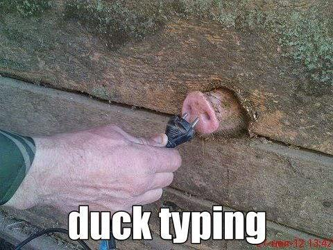

_"Czy jeśli coś chodzi jak kaczka i kwacze jak kaczka, to czy jest kaczką?"_

Początkowo to pytanie, może wydać się dziwne, jednak w dzisiejszym poście będziemy próbowali sobie na nie odpowiedzieć. Właściwie to taką odpowiedź dostarczą nam systemy typowania stosowane w językach programowania.

## Różne systemy typów

Każdy z języków programowania posiada określony system typów. Jest to zestaw reguł, które pozwalają na przypisanie właściwości zwanej typem do odpowiedniej struktury takiej jak zmienna czy funkcja. Następnie w zależności od reguł typy są dopasowywane do siebie i weryfikowane. Jeśli struktury łamią reguły, jest to uznane za błąd.

Systemy typowania możemy podzielić na wiele różnych kategorii, nas będą interesować:

- **typowanie nominalne** - zgodność typów określa się na podstawie jawnych deklaracji i/lub nazwy typów. Przykłady języków z tym rodzjem typowania to np. C# czy Java
- **typowanie strukturalne** - zgodność typów określana jest na podstawie struktury (zestaw pól i metod zawartych w abstrakcji). Występuje ono np. w Typescript
- **duck typing** - najbardziej dynamiczny rodzaj typowania z wymienionych. Określa zgodność typu na podstawie **części struktury, do której uzyskiwany jest dostęp w czasie wykonywania programu**. Taki rodzaj typowania występuje min. w Javascript

Definicje te brzmią nieco skomplikowanie, dlatego wytłumaczmy to sobie na przykładach. Pierwszy z nich dotyczy typowania nominalnego.

```javascript
class Foo {
  method(input: string): number { ... }
}

class Bar {
  method(input: string): number { ... }
}

let foo: Foo = new Bar(); // Error!
```

Mamy tu próbę przypisania obiektu o typie `Bar` do zmiennej o typie `Foo`. Deklaracje typów są różne, co oznacza błąd w typowaniu nominalnym. Następne to typowanie strukturalne.

```javascript
class Foo {
  method(input: string): number { ... }
}

class Bar {
  method(input: string): number { ... }
}

class Boo {
  method(input: string): boolean { ... }
}

let foo: Foo = new Bar(); // Ok!
let boo: Foo = new Boo(); // Error!
```

Widzimy tutaj jak w pierwszym przypadku mimo różnych nazw typów, zmienna została zaincjalizowana. Dzięki identycznej strukturze klas `Foo` oraz `Bar` jest to możliwe.

W drugim przypadku dla klasy `Boo` funkcja `method` zwraca typ `boolean`, co powoduje niezgodność struktur i zwrócenie błędu. Ostatni przykład odnosi się do duck typing.

```javascript
class Bar {
  method() {
    return 1;
  }

  bar() {
    return "bar";
  }
}

class Foo {
  method() {
    return true;
  }
}

class Boo {
  boo() {
    return "boo";
  }
}

function callMethod(object) {
  console.log(object.method());
}

const bar = new Bar();
const foo = new Foo();
const boo = new Boo();

[
  bar, // Ok!
  foo, // Ok!
  boo, // Error!
].forEach(o => callMethod(o));
```

W tym rodzaju typowania nie mają znaczenia nazwy typów (klasa `Bar`, `Foo`, czy `Boo`), ani różnice w strukturze każdej z klas. Błąd dostajemy tylko w jednym przypadku, kiedy w klasie nie została zdefiniowana funkcja potrzebna do wykonania kodu.

Wróćmy do definicji duck typing: _"określa zgodność typu na podstawie części struktury, do której uzyskiwany jest dostęp w czasie wykonywania programu"_. W naszym przykładzie wspomniana "część struktury" to właśnie `method`. Kiedy ona nie istnieje, albo nie jest funkcją, otrzymujemy błąd.

Możemy teraz stwierdzić jak poszczególne systemy typowania odpowiedzą na pytanie zadane na początku - _"Czy jeśli coś chodzi jak kaczka i kwacze jak kaczka, to czy jest kaczką?"_

- typowanie nominalne - _"Nie, tylko coś o typie kaczka nią jest, nie interesuje mnie zachowanie!"_
- typowanie strukturalne - _"To zależy. Tak, jeśli chodzi jak kaczka, kwacze jak kaczka i nie robić nic innego. W przeciwnym wypadku to nie jest kaczka"_
- duck typing (hmm od czego ta nazwa..) - _"Oczywiście! To zachowanie pasuje do kaczki, więc to na pewno kaczka!"_

> Jeśli zaczynasz programować w Typescript i przeszedłeś z języka o typowaniu nominalnym, to pamiętaj, że Typescript ma typowanie strukturalne! Pomoże Ci to w przyszłości uniknąć wielu "dziwnych" błędów i zrozumieć pewne "dziwne" konstrukcje. Co do typów nominalnych Typscript posiada [otwarty wątek](https://github.com/microsoft/TypeScript/pull/33038).

<figure style="width: 100%; margin-left: 0;">
  <a href="assets/execution-context.gif">  
    
  </a>
  <figcaption>Czy jeśli ktoś stuka w klawiaturę to już programista?</figcaption>
</figure>

## Duck Typing, a podniesienie jakości kodu

Poznaliśmy już teorię stojącą za duck typing, oraz różnice między systemami typów. Jak możemy to wykorzystać w praktyce?

Duck typing podobnie jak [polimorfizm](https://miscoded.io/pl/blog/subtelne-powtorzenia-polimorfizm/), czy [wzorzec strategii](https://miscoded.io/pl/blog/subtelne-potworzenia-wzorzec-strategii/) pomoże nam w usunięciu powtórzeń w naszym kodzie. I znów będzie to związane z powtarzającymi się instrukcjami `switch`, lub `if-else` mającymi identyczny zestaw warunków.

Omówimy teraz problem z którym ostatnio zetknąłem się w pracy.

Musieliśmy przygotować testy wydajności dla części naszych widoków. Miały one za zadanie wykonać określoną operację na wierszu lub grupie wierszy i zalogować czas trwania operacji, oraz wiersza/wierszy których operacja dotyczyła. Testy początkowo obejmowały:

- tworzenie
- edycję
- pobranie danych

Przed wykonaniem testy należało go skonfigurować, więć każdy z testów był podzielony na fazę konfiguracji i uruchomienia.

Na początek naiwna implementacja - powtarzających się instrukcji `switch`.

```javascript
/* main.js */
log(runTest(createTest("create"))); // perfCreateTest === "create";

/* perf-tests.js */
function createTest(type) {
  switch (type) {
    case "create":
      return setupCreateTest();
    case "edit":
      return setupEditTest();
    case "query":
      return setupQueryTest();
    default:
      throw new Error("wrong test type");
  }
}

function runTest(type) {
  switch (type) {
    case "create":
      return runCreateTest();
    case "edit":
      return runEditTest();
    case "query":
      return runQueryTest();
    default:
      throw new Error("wrong test type");
  }
}
```

Implementacja ta jest ciężka do modyfikacji. Kiedy testy zostaną rozszerzone o kolejne typy, oraz nowe fazy, spowoduje to, że dla każdego nowego typu testów będziemy musieli wprowadzać poprawki w wielu miejscach. Z czasem stanie się to trudne i uciążliwe.

Lepszym rozwiązaniem jest stworzyć klasę dla każdego testu i w niej zawrzeć szczegóły dotyczące logiki związanej z każdą fazą. Następnie wykorzystując duck typing (konieczność posiadania funkcji `setup` i `run`) skonfigurować testy i je uruchomić. Utrzymanie tej wersji będzie mniej problematyczne. W przypadku nowego rodzaju testu wystarczy stworzyć dodatkową klasę.

```javascript
/* main.js */
const tests = [
  new PerfCreateTest(),
  new PerfEditTest(),
  new PerfQueryTest(),
].forEach(test => test.setup());

tests.forEach(test => log(test.run()));

/* perf-tests.js */
class PerfCreateTest {
  setup() {
    // ...some logic here
  }

  run() {
    // ...some logic here
    return {
      time,
      createdItemId,
    };
  }
}

class PerfEditTest {
  setup() {
    // ...some logic here
  }

  run() {
    // ...some logic here
    return {
      time,
      editedItemId,
    };
  }
}

class PerfQueryTest {
  setup() {
    // ...some logic here
  }

  run() {
    // ...some logic here
    return {
      time,
      numerOfItems,
    };
  }
}
```

## Duck Typing, a polimorfizm

Schemat działania w powyższym przykładzie jest bardzo podobny do [polimorfizmu](https://miscoded.io/pl/blog/subtelne-powtorzenia-polimorfizm/). Niektórzy z tego powodu stwiają znak równości między duck typing'iem i polimorfizmem. **To błąd!**. Mimo, że efekt użycia tych dwóch mechanizmów w Javascript jest podobny, mają one inne założenia.

Polimorfizm opiera się na typach i polega na wywołaniu odpowiedniej funkcji w zależności od typu. Dzięki temu mechanizmowi obiekt klasy bazowej, można "podmienić" w czasie działania programu na obiekt jednej z klas dziedziczących i wywołać funkcję powiązaną z konkretną klasą (typem).

Jak już dziś wspomnieliśmy duck typing opiera się o strukturę, a właścwie część struktury, która jest użyta podczas wykonywania programu.

## Kontrola typów, pomaga czy przeszkadza

Duck typing daje dużo swobody ze względu na swoją dynamikę. Jednak z czasem może doprowadzić to do błędów trudnych do znalezienia i zwiększeniu czasu potrzebnego na zrozumienie działania kodu.

```javascript
/* main.js */
const tests = [
  new PerfQueryTest(),
  new Human(), // It's correct for Javascript Type System, but should it be?
].forEach(test => runTest(test));

/* perf-tests.js */
function runTest(testObject) {
  // ...some logic here
  testObject.run();
}

class Human {
  run() {
    console.log("I'm running");
  }
}

class PerfQueryTest {
  run() {
    // ...some logic here
    return { data: "test data" };
  }
}
```

Wyżej widzimy konsekwencje braku odpowiedniej kontroli typów. Dopasowanie struktur powoduje, że wszystko działa, ale czy jest to poprawne? Spoiler: nie jest!



Rozwiązaniem na to jest kontrola typów, struktur i flow naszego programu. Możemy wykorzystać JsDoc, czy Typescript. Zalecam to szczególnie przy większych projektach z dużą liczbą skomplikowanych abstrakcji. Da nam to więcej informacji na temat struktur i dzięki temu łatwiej będzie nam modyfikować kod po dłuższym czasie, czy wejść nowym programistą do projektu.

## Podsumowanie

Duck Typing to koncepcja, którą powinnien znać każdy programista Javascript. Dzięki niej możemy uniknąć powtórzeń w kodzie i zwiększyć elastyczność rozwiązania. Jednak podobnie jak każdego narzędzia, również tego trzeba używać z rozsądkiem, kontrolując struktury jakie mamy w naszym kodzie i ich odpowiedni przepływ. Tylko to pozwoli nam zwiększyć jakość naszego kodu i zmniejszyć czas poświęcony na jego utrzymanie.
