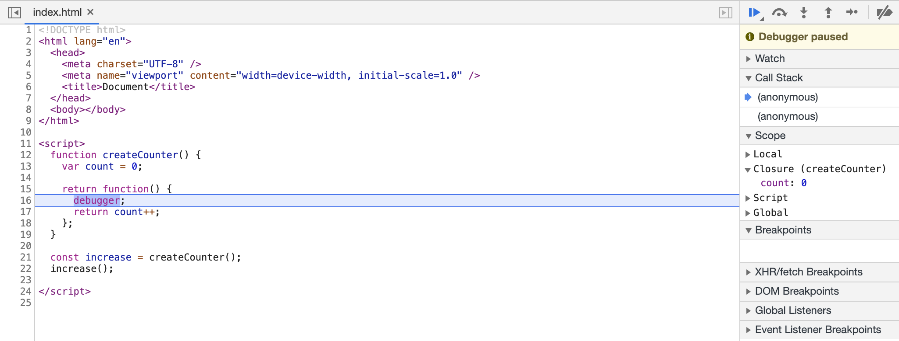

Witam Cię w czwartym artykule z serii "Opanuj Fundamenty!". Opisuję w niej działanie mechanizmów języka Javascript. W ostatnim poście zajęliśmy się zakresami, dziś dowiesz się więcej o domknięciach. Czym są domknięcia? Jak język Javascript je realizuje, oraz jak można wykorzystać je w praktyce? Na te pytania odpowiem w dzisiejszym artykule.

## Dzieciństwo i co z niego pamiętamy

Zanim zagłębimy się w techniczny świat, chciałbym powiedzieć o dzieciństwie. Spokojnie nie będzie to żadna psychologiczna, coachingowa gadka. Ma pomóc w zrozumieniu dzisiejszego tematu.

Już od kilku lat, mieszkam poza swoją rodzinną miejscowością, ale za każdym razem, gdy do niej wracam, doskonale pamiętam wszystkie miejsca, w których bawiłem się jako dziecko, podstawówkę czy boisko do piłki. Nawet teraz bez problemu jestem w stanie przywołać wszystkie te miejsca, **które były związane z moimi początkiem.** Jestem pewny, że Ty również bez problemu przywołasz w swojej pamięci miejsca związane z Twoim dzieciństwem. Zapamiętaj to co powiedziałem, przyda się później.

## Domknięcie

Jeszcze jedna istotna rzecz, zanim przejdziemy do bohatera dzisiejszego postu (obiecuję ostatnia!). Przypomnijmy sobie, czym są zakresy i jak definiują one dostęp do zmiennych w Javascript.

```javascript
function outer() {
  var a = 10;

  function inner() {
    var b = 20;
    console.log(a + b); // access to a and b
  }

  inner();
}

console.log(a); // ReferenceError
```

W powyższym kodzie występują 3 zakresy:

- globalny
- lokalny (funkcji outer)
- lokalny (funkcji inner)

Oprócz tego w linii 6 i 12 mamy:

- dostęp do zmiennej `b` w lokalnym zakresie, oraz `a` znajdującej się w zewnętrznym zakresie względem wykonywanego kodu (linia 6)
- błąd przy próbie uzyskania zmiennej `a` będącej w zakresie lokalnym, z poziomu zakresu globalnego (linia 12)

Widzimy, że dostęp do zmiennych zdefiniowany jest poprzez ich fizyczne położenie w kodzie. Możemy dostać się tylko do zmiennych z zakresów zewnętrznych.

Pytanie, co jeśli funkcja zwróci inną funkcję, która w swoim ciele wykorzystuje zmienne z zewnętrznego zakresu? Przykład takiego kodu:

```javascript
function outer() {
  var a = 10;

  function inner() {
    var b = 20;
    console.log(a + b); // access to a and b
  }

  return inner;
}

var foo = outer();

foo(); // 30
```

Zmienna `foo` to referencja do funkcji `inner`. W swoim zakresie zawiera zmienną `b` dzięki temu może jej użyć w `console.log`. Pytanie, co z drugą zmienną i dlaczego nie otrzymaliśmy błędu?

W końcu zmienna `a` nie znajduje w zakresie funkcji `inner` oraz nie jest dostępna z zakresu globalnego, czyli z miejsca w którym wywołaliśmy `foo`. Dodatkowo po zakończeniu funkcji `outer` wszystkie lokalne zmienne, powinny zostać wyszczyszczone. Odpowiedzią na to są domknięcia.

Domknięciem nazywamy możliwość funkcji polegającą na "zapamiętaniu" wszystkich zmiennych dostępnych w ramach zakresu, **w którym funkcja została utworzona** i ich późniejszym wykorzystaniu, nawet jeśli funkcja wywoływana jest, poza zakresem, w którym została stworzona.

Przypomnij sobie teraz moją opowieść o dzieciństwie. Podobnie jak ja jestem w stanie przywołać miejsca związane z moim początkiem, tak funkcja może odnieść się w każdym momencie do zmiennych w zakresie, w którym została utworzona. To miejsca związane z jej początkiem.

Z racji, że to dość skomplikowany temat, przeanalizujmy kod w celu lepszego zrozumienia tego mechanizmu.


Funkcja `inner` została stworzona w zakresie funkcji `outer`. W ramach tego zakresu ma ona dostęp do zmiennej `a`. Dzięki temu może tę zmienną zapamiętać i użyć jej, kiedy zostanie wywołana poza zakresem funkcji `outer` tak jak w przykładzie, w zakresie globalnym.

Co ważne, żeby zaobserwować domknięcie, należy wywołać funkcję w innym zakresie niż, w tym w którym została zdefiniowana.

Jeśli wciąż nie jest to dla Ciebie jasne, dodajmy, że funkcje w Javascript są wartościami pierwszej klasy (ang. First Class Objects), dzięki temu mamy możliwość przesyłania ich jako argumenty, bądź zwracania jako wartość innej funkcji.

Domknięcie w tym wypadku, jest powiązaniem między funkcją a wszystkimi zmiennymi w zakresie w którym została stworzona. Dzięki temu niezależnie gdzie zostanie przesłana, bądź zwrócona może się do nich odwołać.

## Referencja, nie wartość

Funkcja w ramach domknięcia zapamiętuje referencje do zmiennych, a nie ich aktualną wartość. Oznacza to, że podczas wywołania funkcja, może otrzymać inną wartość zmiennej niż w momencie tworzenia domknięcia.

```javascript
function createCounter() {
  var count = 0;

  return function increase() {
    return count++;
  };
}

var increaseCounter = createCounter();

// count = 0
increaseCounter();
// count = 1
increaseCounter();
// count = 2
```

Fakt, że funkcja zapamiętuje referencje, a nie wartość czasem myli programistów. Jeden z popularniejszych problemów polega on utworzeniu funkcji w pętli, a następnie wywołaniu tych funkcji już po zakończeniu pętli wykorzystując np. `setTimeout`. Kod poniżej:

```javascript
for (var i = 0; i < 3; i++) {
  setTimeout(function() {
    console.log(i); // Result in console: 3 3 3
  }, 1000);
}
```

Wyniki, jaki zobaczymy w konsoli to `3 3 3` zamiast często spodziewanego `1 2 3`.

Warto wiedzieć, że funkcja przekazana jako callback, wykorzystuje domknięcie. W powyższym przypadku funkcje anonimowe (linia 2) w ramach zakresu w którym zostają zdefiniowane, zapamiętują **referencję** do zmiennej `i`. Dzięki temu w momencie wywołania mają dostęp **do jej aktualnej wartości** (mogącej zmienić się w czasie wykonywania programu).

Z racji, że `i` zadeklarowano za pomocą `var`, tworzy się jej pojedyncza instancja w ramach całej pętli. Oznacza to, że po zakończeniu wszystkich przebiegów pętli wartości `i` będzie równa `3`.

Wprowadzenie `setTimout` powoduje, że funkcje anonimowe zostaną wywołane po ostatniej iteracji. W tym momencie każda z funkcji, korzystając z domknięcia, ma dostęp do referencji zmiennej `i`, której aktualna wartość jest równa `3` i to zostaje wypisane w konsoli.

Rozwiązania tego problemu są następujące:

- stworzyć funkcję pośrednią, która zostanie natychmiastowo wywołana w pętli i umieścić w niej `setTimeout`. Zmieni to zakres w ramach którego funkcja anonimowa jest tworzona. Dzięki temu zapamięta parametr, który został przekazany w momencie wywołania funkcji pośredniej.

```javascript
for (var i = 0; i < 3; i++) {
  foo(i);
}

function foo(i) {
  // anonymous function remembers "i" passed as argument to foo
  setTimeout(() => {
    console.log(i);
  }, 1000);
}
```

- użyć `let` zamiast `var`. Słowo kluczowe `let` powoduje, że przy każdej iteracji tworzona jest nowa instancja zmiennej `i`. Dzięki temu w każdym przebiegu pętli tworzona funkcja anonimowa "zapamiętuje" referencję do nowej, niezależnej instancji zmiennej `i`, która nie jest edytowana w kolejnej iteracji.

```javascript
for (let i = 0; i < 3; i++) {
  setTimeout(() => {
    console.log(i);
  }, 1000);
}
```

## Jak silnik Javascript realizuje domknięcia

Każda funkcja posiada ukrytą właściwość `[[Environment]]`. Jest to referencja do zakresu, w którym została stworzona. Właściwość `[[Environment]]` ustawiana jest raz, w momencie tworzenia funkcji, podczas pierwszej fazy wykonywania kodu, zwanej też fazą kompilacji, bądź tworzenia. Silnik Javascript ustawia ją po napotkaniu deklaracji funkcji i dodaniu jej do pamięci.

Następnie podczas wywołania funkcji tworzy się nowy kontekst wykonania, a razem z nim obiekt `LexicalEnvironment`. Jeśli czytałeś [mój post o kontekście wykonania](https://miscoded.io/pl/blog/fundamenty-javascript-kontekst-wykonania/), wiesz, że składa się on z:

- odniesienia do zakresu zewnętrznego
- słownika którego elementami są zmienne, należące do bieżącego zakresu

Odniesienie do zakresu zewnętrznego tego obiektu zaczerpniętej jest z właściowści `[[Environment]]`. Dzięki temu funkcja może uzyskać dostęp do zmiennych z zakresu w którym została utworzona, niezależnie od miejsca jej wywołania.

![Schemat utworzenia i wykorzystania [[Environment]] w Javascript](assets/environment.png)

Chcąć podejrzeć domknięcia np. z poziomu debuggera Chrome, możesz zrobić to poprzez właściwość `Scope`. Zawiera ona odniesienia min. zakresu globalnego, czy właśnie domknięcia.



Podsumowując:

- właściwość `[[Environment]]` tworzy się raz, podczas tworzenia funkcji, kiedy silnik napotyka jej definicję
- w momencie wywołania funkcji i tworzenia dla niej kontekstu wykonania, wartość `[[Environment]]` zostaje ustawiona jako najbliższy zakres zewenętrzny

## Zastosowanie praktyczne

### Wzorzec modułu (ang. Module Pattern)

Dawno, dawno temu, kiedy przeglądarki nie wspierały...a nie, ten początek jakoś mi nie pasuje. A zatem...kilka lat wstecz, kiedy przeglądarki nie wspierały jeszcze żadnego systemu modułów, chcą wprowadzić jakikolwiek ład w kodzie, wykorzystywano wzorzec modułu. Umożliwia on enkapsulację zmiennych i funkcji oraz stworzenie przestrzeni nazw, rozwiązując w pewnym stopniu konflikty wynikające z nazewnictwa.

Polega on na stworzeniu funkcji odgrywającej rolę modułu który, zawiera zarówno pola publiczne i prywatne, które nie powinny być dostępne poza modułem. Sprowadza się to do zwrócenia przez funkcję obiektu z metodami, do których chcemy mieć dostęp z zewnątrz. Żeby to osiągnać należy wykorzystać domknięcie oraz natychmiastowe wywołanie wyrażenia funkcji (ang. Immediately Invoked Function Expression). Wyeksponowane funkcje, dzięki domknięciu mają dostęp do wszystkich innych pól, w tym prywatnych niedostępnych spoza funkcji-modułu. Przykład takiego rozwiązania:

```javascript
var myModule = (function() {
  "use strict";

  var _privateProperty = "Hello World";
  var publicProperty = "I am a public property";

  function _privateMethod() {
    console.log(_privateProperty);
  }

  function publicMethod() {
    _privateMethod();
  }

  return {
    publicMethod: publicMethod,
    publicProperty: publicProperty,
  };
})();

myModule.publicMethod(); // outputs 'Hello World'
console.log(myModule.publicProperty); // outputs 'I am a public property'
console.log(myModule._privateProperty); // is undefined protected by the module closure
myModule._privateMethod(); // is TypeError protected by the module closure
```

### Zapamiętanie części danych lub wyniku funkcji

Założmy, że potrzebujesz funkcje, która pobiera dane przekazująć jej URL i nazwę endpointu.
Jej implementacja mogłaby wyglądać następująco:

```javascript
function getData(baseURL, endpoint) {
  fetch(`${baseURL}${endpoint}`)
    .then(res => res.json())
    .then(data => data);
}

getData("http://some-site-A.com", "/posts");
getData("http://some-site-A.com", "/posts");

getData("http://some-site-B.com", "/comments");
getData("http://some-site-B.com", "/comments");
```

Problem może pojawić się kiedy jest potrzeba zmiany adresu URL, wtedy trzeba go poprawić w kilku miejscach.

Można łatwo to poprawić stosując domknięcie, dodatkowo pomoże nam to pogrupować zapytania np. po URL.

W poniższej implementacji, jeśli zmieni się któryś z adresów URL, wystarczy jedna zmiana w kodzie.

```javascript
function getData(baseURL) {
  return function(endpoint) {
    fetch(`${baseURL}${endpoint}`)
      .then(res => res.json())
      .then(data => console.log(data));
  };
}

/* Services */
const getServiceAData = getData("http://some-site-A.com");
const getServiceBData = getData("https://some-site-B.com");

/* Handle service A */
getServiceAData("/users");
getServiceAData("/posts");

/* Service B requests */
getServiceBData("/users");
getServiceBData("/posts");
```

Jeśli w naszym kodzie mamy do czynienia z cięzkimi operacjami, zajmującymi dużo zasobów, możemy je ograniczyć, stosując zapamiętanie wyników np. po przekazanych parametrach. Domknięcie zostanie wykorzystane tutaj, aby uzyskać dostęp do zmiennej przechowującej zapisane wyniki operacji.

```javascript
const heavyOperation = n => n + 10;

const memoize = fn => {
  let cache = {};

  return (...args) => {
    let n = args[0]; // just taking one argument here

    if (n in cache) {
      console.log("Fetching from cache");
      return cache[n];
    } else {
      console.log("Calculating result");
      let result = fn(n);
      cache[n] = result;

      return result;
    }
  };
};

const memoizedOperation = memoize(heavyOperation);

console.log(memoizedOperation(3)); // calculated
console.log(memoizedOperation(3)); // cached
console.log(memoizedOperation(4)); // calculated
console.log(memoizedOperation(4)); // cached
```

### Domknięcia w popularnych rozwiązaniach (React i Redux)

W ostatnim czasie coraz bardziej popularne React'owe hooki, opierają się o domknięcia.
W przysłości na pewno rozwinę temat hooków i tego jak działają. Jeśli jednak już, chciałbyś dowiedzieć się więcej [tutaj](https://www.netlify.com/blog/2019/03/11/deep-dive-how-do-react-hooks-really-work/).

Jeśli chodzi o Redux, jedną z decyzji architektonicznych było zastosowanie domknięć. [Tutaj](https://redux.js.org/faq/design-decisions#why-does-applymiddleware-use-a-closure-for-dispatch) znajdziesz więcej informacji na ten temat.

## Podsumowanie

W dzisiejszym artykule przedstawiłem domknięcia. Są one bardzo istotnym i często wykorzystywanym mechanizmem Javascript. W drodze do osiągnięcia biegłości w JS na pewno nie możesz ich pominąć. W ramach podsumowania:

- domknięcia są mechanizmem pozwalającym funkcji zapamiętać zmienne w ramach zakresu w którym została zdefiniowana i dostępem do nich, nawet jeśli funkcja wywoływana jest poza zakresem w którym została stworzona
- zapamiętanie zmiennych odbywa się w momencie utworzenia funkcji, a wykorzystana jest do tego ukryta właściwość `[[Environment]]`
- w momencie wywołania funkcji jej najbliższy, zewnętrzny zakres ustawiany jest na ten przechowywany we właściowści `[[Environment]]`
- w praktyce domknięcia wykorzystywane są między innymi do cachowania wyników czy enkaspulacji zmiennych i funkcji
