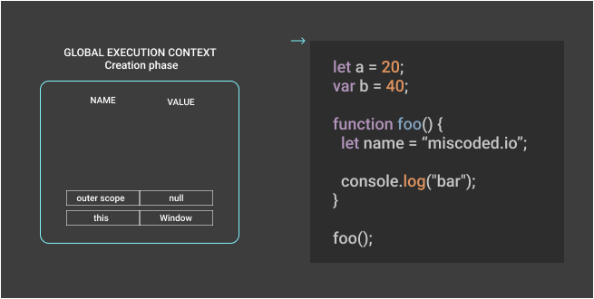

Cześć! Czytasz właśnie pierwszy wpis na blogu miscoded.io. Będę tu opisywał rzeczy związane ze światem Javascript, poczynając od opisu działania silnika poprzez wzorce projektowe, a kończąc na testowaniu aplikacji.

## Fundamenty Javascript

Mistrzem gry zostaje ten kto, dobrze poznał jej reguły, dlatego ważne, żebyś znał zasady rządzące światem JSa. Możemy je określić fundamentami języka, a są nimi:

- kontekst wykonania (ang. Execution Context)
- zakres zmiennych (ang. Scope of variables)
- domknięcia (ang. Closures)
- proptypy (ang. Prototype)

W tym i następnych postach przyjrzymy się każdemu z tych zagadnień, odpowiadając jednocześnie na pytanie, jak jego znajomość poprawi jakość Twojego kodu.

Część z Was pewnie zada sobie w tym momencie pytanie: "Po co mi to wiedzieć? Do programowania w React czy Angularze nie jest mi to potrzebne!". Można powiedzieć, że te osoby po części mają rację, nie muszą posiadać wiedzy, o kontekście wykonania, żeby stworzyć aplikację z użyciem (wpisz tutaj dowolny framework lub bibliotekę, której używasz). Jednak każda biblioteka czy framework w JS wykorzystuje mechanizmy, które opiszę w tym i następnych postach. Jeśli dobrze je poznasz, ułatwi Ci to zrozumienie działania kodu i tym samym jego łatwiejsze debugowanie i rozwiązywanie potencjalnych błędów i problemów.

Przykładem może być odpowiednie przypisanie wartości `this` w komponentach klasowych w React. Wiesz kiedy i dlaczego należy użyć `bind`? Jaka jest różnica między zwykłą funkcją, a strzałkową w tej sytuacji? Rozumiesz mechanizm działający "pod spodem" takiego procesu? Potrafisz wyjaśnić gdzie Javascript przechowuje informację o wartości zmiennej `this`?

Jeśli na któreś z pytań odpowiedziałeś przecząco, zapraszam do dalszej części artykułu (nawet jeśli wszystkie odpowiedzi były twierdzące też zapraszam). Poniżej kod dla wspomnianego problemu:

```javascript
class Toggle extends React.Component {
  constructor(props) {
    super(props);
    this.state = { counter: 0 };

    // #1 This binding is necessary to make `this` work in the callback. Why?
    this.handleClick = this.handleClick.bind(this);
  }

  handleClickArrow = () => {
    // #2 Binding here is unnecessary. Why?
    this.setState(prevState => ({
      counter: prevState.counter + 1,
    }));
  };

  handleClick() {
    this.setState(prevState => ({
      counter: prevState.counter - 1,
    }));
  }

  render() {
    return (
      <>
        <button onClick={this.handleClickArrow}>Increase</button>
        <button onClick={this.handleClick}>Descrease</button>
        <br />
        Counter: {this.state.counter}
      </>
    );
  }
}
```

## Kontekst wykonania (ang. Execution Context)

Zacznijmy od definicji: **kontekst wykonania jest abstrakcyjną koncepcją która zawiera informację o środowisku, w którym wykonywany jest bieżący kod**. Możesz traktować to jak obiekt w którym znajdują się min. identyfikatory zmiennych i funkcji czy wartość `this`.

W momencie pisania artykułu specyfikacja ECMAScript rozróżnia przynajmniej 4 rodzaje kodu. Nazwijmy je kodem globalnym, funkcji, modułu i funkcji `eval`. Każdy z nich wykonywany jest w ramach kontekstu wykonania, którego struktura w zależności od rodzaju kodu jest inna. Dodatkowo mamy np. generatory, dla których struktura kontekstu wykonania będzie inna niż tego wykorzystywanego przez zwykłe funkcje.

W tym artykule zajmiemy się dwoma podstawowymi kontekstami: globalnym i funkcji.

Kontekst globalny tworzony jest **przed rozpoczęciem przetwarzania kodu skryptu**, kontekst funkcyjny tworzy się za **każdym wywołaniem funkcji**, nawet jeśli wywołuje ona samą siebie.

## Dwie fazy kontekstu wykonania

Jak dowiedzieliśmy się z poprzedniego rozdziału, konteksty tworzone są na różnych etapach wykonywania kodu. Należy dodać, że na zbudowanie kontekstu składają się dwie fazy:

- *faza tworzenia* (ang. Creation Phase)
- *faza wykonania* (ang. Execution Phase).

Dla globalnego kontekstu faza tworzenia, ma miejsce przed przetworzeniem pierwszej linii skryptu, a dla kontekstu funkcji, gdy funkcja zostanie wywołana, lecz przed wykonaniem zwartego w niej kodu (wartości nie są jeszcze przypisane do zmiennych). Podczas tej fazy występuje:

1. Utworzenie zakresu
2. Utworzenie odniesienia do zewnętrznego zakresu
3. Określenie wartości `this`

### Utworzenie zakresu

Na początku nalezałoby zadać sobie pytanie czym jest zakres?
Możesz myśleć o nim jak o słowniku który mapuje identyfikatory zmiennych na konkretne wartości.
Utworzeniem zakresu nazywamy określenie, które identyfikatory zmiennych i funkcji są dostępne w ramach bieżącego zakresu
(jakie identyfikatory należą do tego obiektu)
Silnik Javascript skanuje kod, w poszukiwaniu deklaracji zmiennych i funkcji po czym umieszcza ja w pamięci.
Zmiennym nie przypisuje się w tym momencie wartości.

### Utworzenie odniesienia do zewnętrznego zakresu

Kiedy silnik JS chce uzyskać dostęp do zmiennej przeszukuje najpierw zakres w bieżącym kontekście wykonania, jeśli nie znalazł identyfikatora szukanej zmiennej, przechodzi do zewnętrznego zakresu. Sytuacja powtarza się, aż do znalezienia odpowiedniego identyfikatora, bądź przejścia do zakresu globalnego, który jest najbardziej zewnętrznym zakresem. Tworzenie takich łańcuchów możliwe jest dzięki zapisaniu referencji do zewnętrznego zakresu.

### Ustawienie wartości `this`

Dla słowa kluczowego `this` ustawienie wartości nie wiąże się ze wspomnianym przeszukiwaniem przy użyciu zakresów. Jego wartość ustalana jest raz w momencie tworzenia kontekstu. `this` wskazuje na obiekt, na którego rzecz zostało wywołane. Dla kontekstu globalnego jest to zawsze obiekt hosta (`window` w przeglądarce). Jeśli natomiast wywołasz funkcje z użyciem referencji do obiektu, `this` wskazuje na ten obiekt.

```javascript
const person = {
  name: "Joe",
  sayHello: function() {
    console.log(`Hi, I'm ${this.name}`);
  },
};

person.sayHello(); // "Hi, I'm Joe" -> function calling by reference to object
// this points out object "person"

const hello = person.sayHello;

hello(); // "Hi, I'm undefined" -> function calling without reference,
// this points out global window object
```

Co należy zapamiętać, to fakt, że obiekt na który wskazuje `this` **ustalany jest w momencie wywołania, a nie utworzenia funkcji!**

Następna po fazie tworzenia jest faza wykonania. W tej fazie mamy:

1. przypisane wartości zmiennych
2. wykonywanie kodu

Żeby lepiej uświadomić sobie jak wygląda ten proces, ponizej znajdziesz fragment kodu wraz z animacją przedstawiającą obydwie fazy zarówno dla kontkestu globalnego jak i funkcji `foo`:

```javascript
let a = 20;
var b = 40;

function foo() {
  console.log("bar");
}
```

<figure style="width: 100%; margin-left: 0;">
  <a href="assets/execution-context.gif">  
    
  </a>
  <figcaption>Faza tworzenia i wykonania dla kontekstu globalnego i funkcji</figcaption>
</figure>

## Struktura kontekstu wykonania

Powiedzieliśmy, już sobie o tym, jakie są rodzaje kontekstu oraz jak wygląda proces ich tworzenia. Czas na zapoznanie się ze strukturą kontekstu. Zgodnie ze specyfikacją, możemy przedstawić to jako obiekt::

```
ExecutionContext = {
  LexicalEnvironment: {...}
  VariableEnvironment: {...},
  ThisBinding: <this value>
}
```

Należy dodać, że to obiekt teoretyczny. Nie możemy dostać się do niego z poziomu kodu, czy nim manipulować.

Właściwość ThisBinding odpowiedzialna jest za ustawienie `this`.

Pozostałe obiekty wchodzące w skład kontekstu wykonania to LexicalEnvironment i VariableEnvironment. Należy dodać, że posiadają one identyczną strukturę o nazwie...Lexical Environment. Składa się ona z:

- odniesienia do zakresu zewnętrznego
- obiektu nazwanego **EnvironmentRecord** o którym możesz myśleć jak o słowniku, który odwzorowuje nazwy zmiennych na ich wartości. Takiej samej definicji użyłem chwilę wcześniej przy definicji zakresu, bo to właśnie ten obiekt mamy na myśli mówiąc o zakresie.

**EnvironmentRecord** posiada inną strukturę i nazwę dla kontekstu globalnego i kontekstu funkcji:

- **Declarative Environment Record - (kontekst funkcji)** przechowuje deklaracje zmiennych, funkcji i przesłanych argumentów. To w tym obiekcie znajduje się również zmienna `arguments`.
- **Object Environment Record - (kontekst globalny)** służy od definiowania powiązań między zmiennymi i funkcjami dla kontekstu globalnego. Przechowuje również odniesienia do obiektu globanego.

Część z Was mogłaby zadać teraz pytanie. "Dlaczego kontekst wykonania posiada LexicalEnvironment oraz VariableEnvironment o identycznej strukturze? Nie wystarczy tylko jeden taki obiekt? Jakie są między nimi różnice?"

Otóż definicje funkcji oraz zmienne stworzone poprzez `var` przechowywane są w VariableEnvironment, natomiast te stworzone przez słowa kluczowe `let` i `const` znajdują się w LexicalEnvironment.

Kolejna z różnic związana jest ze słowem kluczowym `with`. Pominę to z racji tego, że w praktyce bardzo rzadko korzysta się z rozwiązań z tym słowem kluczowym. Jeśli jednak chciałbyś dowiedzieć się więcej, [tutaj](http://dmitrysoshnikov.com/ecmascript/es5-chapter-3-2-lexical-environments-ecmascript-implementation/#lexical-environment) możesz to zrobić.

## Przykłady

Poniżej znajduje się kod wraz ze schematem struktury kontekstów wykonania (globalnego i funkcji foo). Założmy, że kod znajduje się momencie fazy wykonania dla funkcji `foo`, kiedy wszelkie zmienne zostały już przypisane.

```javascript
let y = 10;

function foo(z) {
  let x = 100;
  return x + y + z;
}

foo(30); // 150
```

")

W ramach wizualizacji kolejnego przykładu zastosujemy pseudokod pokazujący strukturę kontekstu wykonania dla poniższego kodu Javascript, tym razem z podziałem na fazę tworzenia i wykonania:

```javascript
let a = 20;
const b = 30;
var c;

function multiply(e, f) {
  var g = 20;
  return e * f * g;
}

c = multiply(20, 30);
```

Przetwarzanie tego kodu rozpocznie się od utworzenia kontekstu globalnego. W fazie tworzenia wygląda on następująco:

```
// creation phase
GlobalExectionContext = {
  LexicalEnvironment: {
    EnvironmentRecord: {
      Type: "Object",
      // Identifier bindings go here
      a: < uninitialized >,
      b: < uninitialized >,
    }
    outer: <null>,
  },
  VariableEnvironment: {
    EnvironmentRecord: {
      Type: "Object",
      // Identifier bindings go here
      c: undefined,
      multiply: < func >,
      __bindingObject__: <reference do global/window object>
    }
    outer: <null>,
  }
  ThisBinding: <Global Object>
}
```

Widzimy tutaj jeszcze niezainicjalizowane zmienne `a` , `b` oraz `c`. Pokazują one różnicę pomiędzy słowami kluczowymi `let`, `const`, a `var`. Zmienne utworzone przez te `let` i `const` posiadają wartość `uninitialized`, podczas gdy zmienna c utworzona poprzez `var` ma wartość `undefined`. Więcej na temat różnić między `let`, `const` i `var` będziesz mógł się dowiedzieć w jednym z następnych postów.

W fazie wykonania zmienne będą posiadały już przypisane wartości i rozpocznie się wykonywanie kodu, globalny kontekst wykonania będzie miał postać:

```
// Execution Phase
GlobalExectionContext = {
  LexicalEnvironment: {
    EnvironmentRecord: {
      Type: "Object",
      // Identifier bindings go here
      a: 20,
      b: 30,
    }
    outer: <null>,
  },
  VariableEnvironment: {
    EnvironmentRecord: {
      Type: "Object",
      // Identifier bindings go here
      c: undefined,
      multiply: < func >,
  __bindingObject__: <reference do global/window object>
    }
    outer: <null>,
  }
  ThisBinding: <Global Object>
}
```

W momencie, w którym silnik Javascript napotka wywołanie funkcji `c = multiply(20, 30);` zostanie utworzony nowy kontekst funkcji. W fazie tworzenia kontekst ten będzie miał postać:

```
FunctionExectionContext = {
LexicalEnvironment: {
    EnvironmentRecord: {
      Type: "Declarative",
      // Identifier bindings go here
    },
    outer: <GlobalLexicalEnvironment>,
    ThisBinding: <Global Object or undefined>,
  },
VariableEnvironment: {
    EnvironmentRecord: {
      Type: "Declarative",
      // Identifier bindings go here
      g: undefined
      Arguments: {0: 20, 1: 30, length: 2},
    },
    outer: <GlobalLexicalEnvironment>,
    ThisBinding: <Global Object or undefined>
  }
}
```

Kiedy wszelkie wartości zmiennych zostaną już przypisane i rozpocznie się wykonywanie kodu, kontekst wykonania dla funkcji `foo` będzie miał następujący schemat:

```
FunctionExectionContext = {
 LexicalEnvironment: {
    EnvironmentRecord: {
      Type: "Declarative",
      // Identifier bindings go here
    },
    outer: <GlobalLexicalEnvironment>,
    ThisBinding: <Global Object or undefined>,
  },
 VariableEnvironment: {
    EnvironmentRecord: {
      Type: "Declarative",
      // Identifier bindings go here
      g: 20
      Arguments: {0: 20, 1: 30, length: 2},
    },
    outer: <GlobalLexicalEnvironment>,
    ThisBinding: <Global Object or undefined>
  }
}
```

### Execution Stack

Konteksty podczas wykonywania kodu przechowywane są w strukturze zwanej Execution Stack. Jest to stos o strukturze LIFO (last in, first out). Jeśli nie nie znasz tego pojęcia, możesz myśleć o tym, jak o stosie talerzy. Ostatni talerz odłożony na stos (znajdujący się na szczycie) jest pierwszym, który zostanie z niego zabrany.

W momencie uruchamiania skryptu silnik Javascript tworzy kontekst globalny i umieszcza go w Execution Stack.

Podczas wykonywania kodu, kiedy silnik Javascript napotka wywołanie funkcji, tworzy dla niej nowy kontekst i wypycha go na szczyt stosu. W tym momencie kod przetwarzany jest z użyciem nowego kontekstu będącego na szczycie. Po zakończeniu funkcji kontekst z nią związany jest zdejmowany ze stosu.

Ponizej kod wraz ze schematem działania Execution Stack.

```javascript
let a = "Hello World!";

function foo() {
  console.log("Inside foo function");
}

foo();
console.log("Inside Global Execution Context");
```


## Podsumowanie

Programista powinien, choć w minimalnym stopniu znać i rozumieć proces przetwarzania i działania wewnętrznych mechanizmów związanych z wykonywaniem kodu, który napisał. Dzięki temu będzie mógł tworzyć efektywniejsze rozwiązania, łatwiej znajdować i poprawiać potencjalne problemy. Dziś wykonaliśmy pierwszy krok w stronę zrozumienia tych mechanizmów dla języka Javascript, poznaliśmy kontekst wykonania. Przeanalizowaliśmy jego strukturę, proces tworzenia i dowiedzieliśmy się, jak nowo utworzone konteksty przechowywane są na stosie.

Jeśli miałbyś zapamiętać tylko najważniejsze rzeczy z tego artykułu, chciałbym, żeby to były informacje o tym, że:

- przetwarzanie kodu w Javascript składa się z dwóch faz. Ta wiedza przyda się choćby do zrozumienia mechanizmu windowania (ang. Hoisting)
- kontekst wykonania dla funkcji tworzy się w momencie jej wywołania (a nie utworzenia) i właśnie wtedy określa się, na który obiekt będzie wskazywać zmienna `this`
