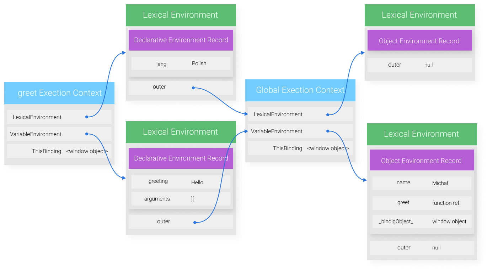

Witam Cię w trzecim artykule z serii "Opanuj Fundamenty". Opisuję w niej podstawowe mechanizmy silnika Javascript. Dziś przyjrzymy się jednemu z kluczowych elementów, zakresowi (ang. Scope). Czy wiesz jakie mamy rodzaje zakresów w Javascript? Co to jest zakres leksykalny? Jak zakres powiązany jest z kontekstem wykonania? Jeśli chcesz poznać odpowiedzi na te pytania, bądź utrwalić swoją wiedzę zapraszam.

## Zakres zmiennych

Jeśli chodzi o zakres (ang. Scope) definicji jest wiele, ja przedstawię dwie moim zdaniem najbardziej obrazowe:

1. jest to zbiór zasad służący określeniu, które zmienne są dostępne w określonym miejscu w kodzie (fizyczna lokalizacja)
2. zakresem zmiennej określamy region w kodzie w którym ta zmienna jest dostępna

Trzeba dopowiedzieć, że zakres zmiennych w Javascript, jest zakresem leksykalnym. Co to znaczy dowiesz się w dalszej części artykułu.

Wracając do naszych definicji widzimy, że w obu powtarza się słowo "dostęp", bo to właśnie zakres określa czy mamy dostęp do jakiejś zmiennej czy nie. Spójrzymy na poniższy kod:

```javascript
var a = 10;

function foo() {
  var b = 5;
  console.log(a + b); // 15
}

console.log(a); // 10
console.log(b); // Reference Error
```

W powyższym przykładzie, możemy zobaczyć, że w linii 9 dostaliśmy błąd. Zasady (zakres) wprowadzone w Javascript nie pozwalają na dostęp do zmiennej `b` z tego miejsca, czy zgodnie z drugą definicją, region w którym wywołaliśmy zmienną `b` nie ma do niej dostępu. Możemy zadać sobie w tym momencie pytanie: Jaki region ma do niej dostęp?

Jest to funkcja `foo`, a wykorzystano tutaj jeden z możliwych zakresów w Javascript: **zakres lokalny**.


## Rodzaje zakresów

W momencie pisania artykułu w języku Javascript wyróżniamy 3 rodzaje zakresów:

- globalny
- lokalny nazywany też zakresem funkcji
- bloku

### Zakres globalny

Każda zmienna która nie została zdeklarowana w funkcji, lub bloku (parze nawiasów klamrowych) należy do zakresu globalnego. Oznacza to, że do zmiennych znajdujących w tym zakresie mamy dostęp z dowolnego miejsca w naszym programie. Jak w poniższym kodzie w którym zmienna `greeting` może zostać użyta zarówno w funkcji `outer` jak i `inner`.

```javascript
var greeting = "hello world!";

function outer() {
  inner();
  console.log("outer: " + greeting); // outer: hello world!

  function inner() {
    console.log("inner: " + greeting); // inner: hello world!
  }
}

outer();
```

### Zakres lokalny (funkcji)

Przyszedł czas na wspomniany już dziś zakres lokalny. Zmienne zadeklarowane wewnątrz funkcji znajdują się w zakresie lokalnym. Dostęp do nich można uzyskać tylko z poziomu tej funkcji. Oznacza, to ze próba dostania się do zmiennej należącej do zakresu lokalnego (ciała funkcji), poza tym zakresem zakończy się błędem. Rozważmy kod poniżej:

```javascript
function greet() {
  var greeting = "Hello World!";
  console.log(greeting); // Hello World
}

greet();

console.log(greeting); // Uncaught ReferenceError: greeting is not defined
```

Widzimy błąd, przy próbie odwołania się do zmiennej `greeting` zdeklarowanej w zakresie lokalnym (funkcji `foo`) w miejscu będącym już poza tym zakresem.

### Zakres bloku

W ES6 wprowadzone zostały słowa kluczowe `let` oraz `const`, a w raz z nimi pojawił się kolejny rodzaj zakresu ograniczony nawiasami klamrowymi. Oznacza to, że do zmiennych zadeklarowanych przez to słowa kluczowe nie można uzyskać dostępu z zewnątrz pary nawisów klamrowych (w przeciwieństwie do `var`). Obrazuje to przykład poniżej:

```javascript
function foo() {
  {
    var lang = "English";
    let greeting = "Hello World!";
    console.log(greeting); // Hello World
  }

  console.log(lang); // English
  console.log(greeting); // Reference Error
}

foo();
```

## Zagnieżdżanie, łańcuch zakresów i wyszukiwanie zmiennej

Zakresy mogą być w sobie zagnieżdżane, w takim przypadku zmienne z zewnętrznych zakresów są dostępne w zakresach wewnętrznych, ale nie odwrotnie. Przykładem może być poniższy kod, gdzie występują wszystkie 3 wcześniej wymienione zakresy:

```javascript
var name = "Michał";

function greet() {
  var greeting = "Hello";
  {
    let lang = "Polish";
    console.log(`${lang}: ${greeting} ${name}`);
  }
}

greet();
```

Pojęciem powiązanym z zagnieżdżeniem jest łańcuch zakresów. Wykorzystywany jest on podczas procesu wyszukiwania zmiennej. Kiedy silnik Javascript chcę uzyskać dostęp do zmiennej przeszukuje najpierw bieżący zakres, jeśli to mu się nie uda przechodzi do zakresu zewnętrznego i go przeszukuje. Powtarza się to, aż do znalezienia odpowiedniej wartości, bądź przejścia do zakresu globalnego który jest najbardziej zewnętrznym zakresem. W takim wypadku jeśli w zakresie globalnym nie ma szukanej zmiennej zostanie zwrócony błąd. W powyższym kodzie w celu znalezienia zmiennej `name` dla instrukcji `console.log` w linii 7 wykonywane są następujące kroki:

1. Przeszukanie zakresu bloku. Czy znaleziono zmienną o identyfikatorze `name`?

   NIE → przejście do zakresu funkcji `greet`

2. Przeszukanie zakresu dla funkcji `greet`. Czy znaleziono zmienną o identyfikatorze `name`?

   NIE → przejście do zakresu globalnego

3. Przeszukanie globalnego zakresu. Czy znaleziono zmienną o identyfikatorze `name`?
   TAK → zwrócenie wartości zmiennej

Utworzenie łańcuchów możliwe jest dzięki kontekstowi wykonania (ang. Execution Context), a ściślej mówiąc strukturze zwanej Lexical Environment (kontekst wykonania posiada dwie instancje tej struktury odpowiadające za zmienne zadeklarowane słowem `var` i deklaracje funkcji (VariableEnvironment) oraz zmienne zadeklarowane przez `let` i `const` (LexicalEnvironment). Każda z instancji zawiera:

- słownik wiążący identyfikatory zmiennych z ich wartościami (Declarative/Object Environemnt Record) - to ten obiekt mamy na myśli mówiąc o bieżącym zakresie
- odniesienie do obiektu (zakresu) zewnętrznego

Wyżej wspomniany słownik jest używany do wyszukiwania zmiennej, a jeśli nie zostanie znaleziona, dzięki odniesieniu do zakresu zewnętrznego silnik może ponownie wyszukać zmienną w zakresie zewnętrznym. Struktury kontekstu wykonania, oraz LexicalEnvironment dla powyższego kodu będą wyglądać następująco:



## Zakres leksykalny, co to właściwie znaczy?

Wspomnieliśmy, że zakres zmiennych w Javascript jest zakresem leksykalnym. Zanim jednak przejdziemy to wyjaśnienia co to znaczy, powiemy sobie o innym rodzaju zakresu zwanym dynamicznym.

Zakres dynamiczny (ang. Dynamic Scope) charakteryzuje się tym, że zmienne wyszukiwane są najpierw w zakresie lokalnym, a następnie w funkcji która wywołała funkcje lokalną i tak dalej, **w górę stosu wywołań**, aż dojdziemy do głównej funkcji rozpoczynającej wykonanie programu. Dzięki temu, możemy definiować wartość zmiennej dynamicznie w czasie wykonywania programu (run-time). Spójrz na przykład poniżej, załóżmy że jest on napisany **w pseudokodzie w którym działa zakres dynamiczny:**

```javascript
function foo() {
  console.log("output: " + x);
}

function one() {
  var x = 1;
  foo();
}

function two() {
  var x = 2;
  foo();
}

if (Math.random() > 0.5) {
  two(); // output: 2
} else {
  one(); // output: 1
}
```

Mimo braku deklaracji zmiennej w funkcji `foo` nie zostanie zwrócony błąd, bo zakres będzie przeszukiwał funkcję `one` lub `two` w zależności od wartości `Math.random`.

Zakres zmiennej zależy **od sposobu wywołania funkcji w której zmienna się znajduje**, a nie fizycznego położenia deklaracji. Takie rozwiązanie ma miejsce choćby w języku LISP.

W Javascript istnieje bardzo podobny mechanizm. I tutaj pytanie dla Ciebie, co to za mechanizm? Jakie słowo kluczowe go definiuje? Jeśli nie znasz odpowiedzi, znajdziesz ją na końcu artykułu.

Wróćmy teraz do zakresu stosowanego w Javascript. Powiedzieliśmy już sobie, że nazywany jest on leksykalnym. Jego druga nazwa to zakres statyczny. Żeby lepiej go zrozumieć należy wiedzieć, że leksykalizacja (zwaną też tokenizacją) jest jednym z etapów kompilacji kodu (tak, kod Javascript jest kompilowany!). Oznacza to że zakres dla zmiennych powstaje już w czasie kompilacji kodu, a jest on definiowany przez fizyczne położenie funkcji w kodzie. Dzięki temu mamy możliwość zagnieżdżania zakresów poprzez deklarowanie funkcji w funkcji (fizyczne położenie kodu). Sposób wywołania funkcji w żaden sposób nie wpływa tu na zakres zmiennych.

W ramach podsumowania tabelka obrazująca różnice w zakresach statycznym i dynamicznym:

<style>
  .middle-row td {
    border-width: 1px 0 1px 0;
    border-color: black;
    border-style: solid;
  }
</style>
<table style="font-size: 14px;">
<thead>
<tr>
<th>Akcja</th>
<th align="center">Zakres statyczny</th>
<th align="right">Zakres dynamiczny</th>
</tr>
</thead>
<tbody>
<tr>
<td style="width: 150px">Moment zdefiniowania zakresów</td>
<td align="center">W momencie kompilacji kodu (leksykalizacja)</td>
<td align="right">W czasie wykonywania kodu (runtime)</td>
</tr>
<tr class="middle-row">
<td >Od czego zależy zakres zmiennej?</td>
<td align="center">Od fizycznego położenia funkcji w kodzie</td>
<td align="right">Od sposobu wywołania funkcji</td>
</tr>
<tr>
<td>Sposób wyszukiwania zmiennej</td>
<td align="center">Poprzez zagnieżdzanie i łańcuch zakresów. Wyszukianie zaczyna się od przeszukania lokalnej funkcji, a następnie funkcji w której lokalna funkcja została zadeklarowana (decyduje fizyczne położenie)</td>
<td align="right">W górę stosu wywołań. Czyli najpierw przeszukanie lokalnej funkcji, a następnie tej która lokalną funkcje wywołała (decyduje sposób wywołania)</td>
</tr>
</tbody>
</table>

## Moduły, a zakres

Przy okazji zakresu zmiennych i ich dostępności warto wspomnieć o modułach. Omówię tutaj implementacją wprowadzoną przez ES6 wykorzystującą słowa kluczowe `import` i `export`. W skrócie moduły pozwalają na podzielenie kodu na części tym samym ułatwiając programiście zarządzanie zależnościami. W jednym z kolejnych artykułów skupimy się na modułach, teraz chciałbym omówić tylko część związaną z dostępnością zmiennych.

Jeśli chcemy, żeby obiekt (zmienna, funkcja) z jednego modułu był dostępny w innym trzeba go wyeksportować za pomocą słowa kluczowego `export`, a następnie zaimportować w innym pliku za pomocą `import`. W tym przypadku zaimportowana obiekt, będzie traktowany jak globalny, dzięki czemu można odwołać się do niego w dowolnym miejscu w module. Obiekty które nie zostaną wyeksportowane, nie będą dostępne w innych modułach. Przy próbie ich importu otrzymamy błąd.

Żeby to zobrazować załóżmy, że chcielibyśmy wydzielić w naszym kodzie moduł związany z operacjami matematycznymi. W tym przypadku mamy dwa pliki `index.js` w którym znajduje się główna logika naszego programu, oraz plik `math.js` zawierający operację matematyczne. Struktura naszego matematycznego modułu wygląda następująco:

```javascript
export function add(a, b) {
  return a + b;
}

function subtract(a, b) {
  return a - b;
}
```

Eksportujemy tu funkcje `add` dzięki czemu po zaimportowaniu jej w `index.js` będzie ona dostępna w zakresie globalnym. Funkcja `subtract` nie została wyeksportowana więc jest dostępna tylko w ramach modułu `math.js`. Poniżej próba importu i użycia jednej i drugiej funkcji w pliku `index.js`

```javascript
import { add, subtract } from "./math.js";

console.log(add(1 + 1)); // 2;

console.log(subtract(2 - 1)); // subtract is undefined
```

## Odpowiedzi

Mechanizmem w Javascript podobnym do zakresu dynamicznego jest ten zastosowany dla słowa kluczowego `this`. To na co będzie wskazywać `this` zależy od sposobu wywołania funkcji np. poprzez referencje do obiektu czy zastosowanie funkcji `apply`.

## Podsumowanie

W dzisiejszym artykule omówiliśmy zakres zmiennych, jego role w Javascript, rodzaje, proces wyszukiwania zmiennej w oparciu o zagnieżdżone zakresy. Tradycyjnie już jeśli miałbym wskazać najważniejsze elementy do zapamiętania byłby to:

- Zakres zmiennych jest zbiorem zasad definiujących, które zmienne są dostępne w określonym miejscu w kodzie (fizycznej lokalizacji)
- Zakres w Javascript jest zakresem leksykalnym, oznacza to że jest tworzony w czasie kompilacji kodu dzięki temu zależy od fizycznego położenia funkcji
- Mamy 3 rodzaje zakresów: globalny, lokalny, bloku
- Zakresy można zagnieżdżać tworząc z nich łańcuchy, są one wykorzystywane podczas wyszukiwania zmiennej przez silnik Javascript (od zakresu lokalnego, poprzez zakresy zewnętrzne aż do globalnego)
