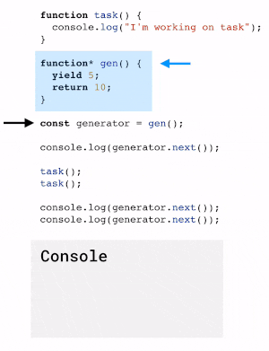
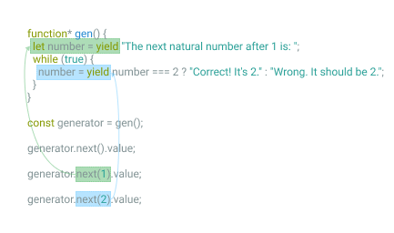

Funkcje są jednym z podstawowych "klocków" których programista używa do tworzenia rozwiązań. Bez nich nie bylibyśmy w stanie tworzyć choćby reużywalnej logiki, co znacznie utrudniłoby proces tworzenia oprogramowania.

Na początku swojej programistycznej drogi uczyłeś się, że funkcja przyjmuje listę argumentów, przetwarza pewną logikę, a następnie zwraca pojedynczą wartość (lub żadnej).

Jednak są obiekty, które pozwalają zmienić to zachowanie, funkcja może zwrócić wartość kilkukrotnie czy nawet zostać zatrzymana. Co to za obiekty?

## Generatory

Odpowiedź to generatory. Poniżej znajdziesz kod zawierający użycie generatora:

```javascript
function task() {
  console.log("I'm working on task");
}

function* gen() {
  yield 5;
  return 10;
}

const generator = gen();

console.log(generator.next()); // { value: 5, done: false }
console.log(task()); // "I'm working on task"
console.log(generator.next()); // { value: 10, done: true }
console.log(generator.next()); // { value: undefined, done: true }
```

Widzimy tu kilka istotnych (i nowych) rzeczy:

- `function*` - znak `*` oznacza , że jest to funkcja generatora (ang. generator function), specjalny rodzaj funkcji, który zwróci nam obiekt generatora
- `yield` - słowo kluczowe związane z generatorem. W momencie napotkania `yield`:
  - wykonywanie funkcji zostaje zatrzymane
  - jej stan jest zapisywany (miejsce w którym została zatrzymana oraz wszelkie zmienne funkcji)
  - zwracana jest wartość znajdująca się po prawej stronie `yield`
- `generator.next()` - główna funkcja generatora, jej wywołanie powoduje wykonanie funkcji, aż do napotkania najbliższej instrukcji `yield`. Innymi słowy rozpoczyna lub wznawia ona wykonywanie funkcji.

Powyższe rzeczy prowadzą do kilku wniosków:

1. Samo wywołanie funkcji generatora, **zwróci tylko obiekt**. Jeśli chcemy, aby rozpoczęło się wykonywanie funkcji należy wywołać przynajmniej raz metodę `next`. Oznacza to, że to **my decydujemy** kiedy generator ma przetworzyć funkcję i zwrócić wartość.
2. Metoda `next`, oraz jej rezultat `{ value, done }` jest zgodny z protokołem iteratora. Nie ma w tym przypadku, generatory mają ułatwić pracę z iteratorami. Jeśli chcesz dowiedzieć się więcej na temat iteratora i protokołów iteracyjnych zapraszam [tutaj](https://miscoded.io/pl/blog/protokoly-iteracyjne-ile-wiesz-o-iteracji/)
3. Można zakończyć wykonywanie funkcji poprzez instrukcję `return`, w przeciwnym wypadku funkcja zakończy się po ostatniej instrukcji. Informuje o tym `done` równe `true` w obiekcie zwracany przez metodę `next`.

```javascript
function* generateValue() {
  yield 1;
}

const generator = generateValue();
console.log(generator.next()); // { value: 1; done: false} <- function is stopped in the last step before finishing
console.log(generator.next()); // { value: undefined; done: true }
```

W powyższym kodzie widzimy zatrzymanie wykonywania funkcji, na ostatnim kroku. Jeśli ją wznowimy funkcja po prostu zakończy się o czym informuje `done` równe true.

> Funkcje w Javascript w których nie określono zwracanej wartości (pominięto `return`) domyślnie zwracają `undefined`

Poniżej animacja przedstawiająca mechanizmy omówione do tej pory:

<figure style="display: flex; flex-direction: column;">
  <a style="text-align: center;" href="assets/generator.gif">  
    
  </a>
  <figcaption>Przetwarzanie kodu zawierającego generator. W momencie napotkania next wskaźnik przesuwany jest do najbliższego wystąpienia yield.</figcaption>
</figure>

## Generator, a iteracja

Wspomniałem, że generator jest iteratorem (implementuje protokół iteratora). Możesz traktować go jak wskaźnik, który pokazuje czy zakończono generowanie elementów (`done`), oraz zwraca wartość aktualnego elementu w sekwencji.

Generator jest również `iterable`, oznacza to, że instrukcje jak `for..of` czy `spread` mogą użyć go do wyciągnięcia wszystkich elementów w sekwencji.

```javascript
function* gen() {
  for (let i = 0; i < 3; i++) {
    yield i;
  }
}

const generator = gen();

for (let element in generator) {
  console.log(element); // 0 1 2
}
```

Skoro generator jest iterowalny, implementuje właściwości o nazwie `Symbol.iterator`. Funkcja do niej przypisana zwraca `this`, dzięki temu podczas iteracji wykorzystywana jest funkcja `next`.

Możemy zobaczyć to w poniższym kodzie. Dodatkowo zamieściłem tam własną implementację generatora opierając się o protokoły iteracyjne. Widać jak użycie generatora skraca kod i czyni go czytelniejszym, dostarczając tej samej funkcjonalności co iterator.

```javascript
function* gen() {
  for (let i = 0; i < 3; i++) {
    yield i;
  }
}
const generator = gen();

// console.log: "f() { return this; }"
console.log(Symbol.iterator in generator && generator[Symbol.iterator]);
/* use iterable */
for (let element of generator) {
  console.log(element); // 0 1 2
}

/* the equivalent of generator object */
const myGenerator = {
  counter: 0,
  [Symbol.iterator]: function() {
    return this;
  },
  next: function() {
    if (this.counter < 3) {
      return { value: this.counter++, done: false };
    }
    return { vaule: undefined, done: true };
  },
};
/* use iterable */
for (let element of myGenerator) {
  console.log(element); // 0 1 2
}
```

### Jak iterować od początku?

Wspomniałem, już, że generator jest wskaźnikiem, który zwróci aktualną wartości i poinformuje, czy pojawi się następna. Ma jednak pewne ograniczenie - nie może poruszać się do tyłu. Oznacza to, że jeśli chcemy iterować od początku, należy stworzyć nowy generator.

> Działanie `for..of` to wywołanie kolejnych `generator.next()`, do momentu w którym właściowść `done` obiektu zwróconego przez `next` jest równa `true`

```javascript
function* gen() {
  for (let i = 0; i < 7; i++) {
    yield i;
  }
}

const generator = gen();

for (let element of generator) {
  if (element > 3) return;
  console.log(element); // 0 1 2 3
}
// the generator is not restarted, it continuous an iteration
for (let element of generator) {
  console.log(element); // 4 5 6
}
```

### Uważaj na `return` podczas iteracji

Instrukcja `return` w generatorze zwraca obiekt `{ value, anyValue, done: true }`, a `for..of` pomija wartości, gdy `done` jest równe `true`. Tym samym wartość zwracana przez `return` nie zostanie wykorzystana.

```javascript
function* gen() {
  yield 1;
  return 2;
}

for (let element of gen()) {
  console.log(element); // 1
}
```

## Komunikacja dwukierunkowa - "yield"

Słowo kluczowe `yield` zapewnia nie tylko zwrócenie wyników z funkcji, działa też w drugą stronę. Pozwala przesłać do funkcji argumenty poprzez `next`. Przy każdym wznowieniu, funkcja może otrzymać argument. Przypisywany jest on do zmiennej będącej po lewej stronie `yield`:

```javascript
function* gen() {
  let number = yield "The next natural number after 1 is: ";
  while (true) {
    number = yield number === 1 ? "Correct! It's 2." : "Wrong. It should be 2.";
  }
}

const generator = gen();

console.log(generator.next().value); // The next natural number after 1 is:
console.log(generator.next(1).value); // Correct! It's 2.
console.log(generator.next(2).value); // Wrong. It should be 2.
```

W powyższym przykładzie widzimy, że generator zwraca wartości tylko na żądanie, nawet jeśli w funkcji występuje nieskończona pętla.



### generator.throw

Przy okazji przesyłania danych do generatora, należy wspomnieć o obsłudze błędów. Generatorowi możemy przekazać informację o wystąpieniu błędu, co poskutkuje wyłapaniem go w najbliższym bloku `try-catch`:

```javascript
function* gen() {
  try {
    let result = yield "2 + 2 = ?";

    console.log(
      "The execution does not reach here, because the exception is thrown above"
    );
  } catch (e) {
    console.log(e); // shows the error
  }
}

let generator = gen();

let question = generator.next().value;

generator.throw(new Error("Some error here"));
```

Przeszliśmy przez wszystkie najważniejsze elementy generatorów, teraz czas odpowiedzieć sobie na pytanie jak możemy je wykorzystać w naszej codziennej pracy.

## Generatory w praktyce

Zacznijmy od często zadawanego pytania: `yield vs async-await ?`.

Jeśli chcemy rozwiązać wyłącznie proste problemy z asynchronicznością np. zsychronizować dane pobierane z różnych źródeł użycie `async-await` jest to bardziej przejrzystym i zalecanym rozwiązaniem.

Jednak generatory wciąż mają swoje miejsce (przynajmniej tak jest w momencie pisania tego postu). Jak dowiedziałeś się w poprzednich rozdziałach, generator przyjmuje i zwraca dane. Oznacza to, że możemy traktować go jako:

- **producenta** - dzięki wykorzystaniu `yield` wartość jest zwracana przy każdym wywołaniu `next`. Dodatkowo generatory to obiekty iterowalne, oznacza to, że mogą generować sekwencję wartości na żądanie (skończoną lub nieskończoną), które będą przetworzone przez `for..or` lub `spread`. Przykład:

  - generowanie kolejnych dopasowanych elementów przy użyciu `regex.exec`, [**źródło i przykład**](https://swizec.com/blog/finally-a-practical-use-case-for-javascript-generators)

- **konsumenta** - dzięki temu, że `yield` może zostać wykorzystane do pobrania danych, generator staje się konsumentem, który wstrzymuje wykonanie pewnej logiki aż do momentu otrzymania określonych danych. Przykład:

  - zwrócenie zbioru danych dopiero po otrzymaniu pełnego zestaw, [**źródło i przykład**](https://jameshfisher.com/2019/05/18/javascript-generators-are-also-consumers/)

- **producenta + konsumenta** - powyższe dwie "zdolności" generatora można połączyć, dzięki temu może zostać on wykorzystany np. zarządzania stanem. Przykład:
  - [**redux-saga**](https://redux-saga.js.org/)

## Podsumowanie

- generatory są obiektami, dzięki którym można kontrolować przebieg wykonywania funkcji, możemy ją (zatrzymać `yield`) lub (wznowić `next`)
- słowo kluczowe `yield` używane jest do komunikacji dwustronnej, zwraca ona wartość z funkcji, oraz pozwala na przesłanie argument do funkcji
- generatory możemy wykorzystać jako producentów i konsumentów danych
