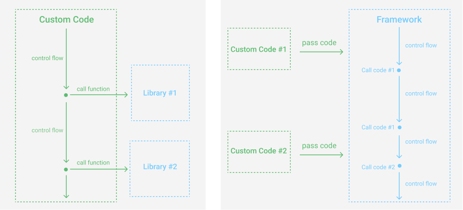

"Odwrócenie sterowania _(ang. Inversion Of Control)_ jedna z fundamentalnych zasad ułatwiających tworzenie reużywalnego kodu i zarządzanie zależnościami w projekcie."

Wiele osób utożsamia ją ze wstrzykiwaniem zależności (ang. Dependency Injection). Jest to jeden z najpopularniejszych sposóbów realizacji odwrócenia zależności. Dziś jednak nie będzie nic o wstrzykiwaniu.

## Paczkomaty, a odwrócenie sterowania

Czy przykładów odwrócenia sterowania możemy szukać poza światem programowaniem? Oczywiście. Poszukiwania ułatwią nam dwa pytania:

- Jak wygląda domyślny proces i co można odwrócić?
- Jakie korzyści przyniesie odwrócenie procesu?

Paczkomaty są dobrym przykładem odwrócenia sterowania. W domyślnym flow listonosz dostarcza paczkę. To on decyduje kiedy i czy ją dostaniemy. Jednak nie zawsze jest to dla nas najlepsza opcja. Możemy być bardzo zajęci nie mamy możliwości czekać na listonosza cały dzień. Jak można to zmienić? Odwrócić sterowanie!

Decydujemy się na usługę Paczkomatów i...to my odbieramy paczkę. Nie czekamy aż ona zostanie nam dostarczona tylko sami podejmujemy działanie. Odpowiedzialność z listonosza przenoszona jest na nas. To my decydujemy kiedy i czy chcemy ją odebrać.

Co dzięki temu zyskujemy? Elastyczność i swobodę. Odbierzemy paczkę kiedy nam to będzie pasować i będziemy mieć na to czas.


## Kto kontroluje kod

Wrócmy do świata programowania. W tradycyjnym podejściu to kod programisty wywołuje odpowiednie funkcje z bibiliotek i steruje wykonaniem programu. Po jego stronie jest odpowiedzialność kiedy funkcje będą wywołane.

Co jeśli odwrócimy ten proces? Programista przesyła funkcje do struktury, która steruje ich wywołaniem. Odpowiedzialność za to **kiedy** coś zostanie wywołane spada na strukturę, programista dostarcza to **co** będzie wywołane.

Definicja z Wikipedii: paradygmat (czasami rozważany też jako wzorzec projektowy lub wzorzec architektury) polegający na przeniesieniu funkcji sterowania wykonywaniem programu do używanego frameworku. Framework w odpowiednich momentach wywołuje kod programu stworzony przez programistę w ramach implementacji danej aplikacji.



Co może być takim frameworkiem? To już zależy od kontekstu i problemu. Przy próbie odwórcenia sterowania i znalezieniu odpowiedniego framework'a pomocne okażą się pytania, które już dziś zadaliśmy:

- Jak wygląda domyślny proces i co można odwrócić?
- Jakie korzyści przyniesie odwrócenie?

## Obsługa zdarzeń

Prosty mechanizm obsługi zdarzeń jest przykładem odwrócenia sterowania. Programista przekazuje funkcję _(co)_, która zostanie wywołana w momencie kliknięcia w przycisk _(kiedy)_.

Co dzięki temu zyskujemy? Przenosimy odpowiedzialność za obsługę zdarzeń do dobrze znanego, powszechnego mechanizmu, nie musimy sami tego implementować.

```html
<button>Click Me</button>

<script>
  const showAlert = () => {
    alert("Hi, I'm Alert");
  };

  const button = document.querySelector("button");
  button.addEventListener("click", showAlert);
</script>
```

## Funkcje: map, find, filter

Standardowe funkcje takie jak `map`, `find` czy `filter` są kolejnym przykładem odwrócenia zależności. Funkcje te jako argument przyjmują wyrażenie zdefinowane przez programistę _(co)_, które wykonują dla każdego z elementów kolekcji _(kiedy)_.

Co dzięki temu zyskujemy? Nie musi implementować przechodzenia po elementach kolekcji. Kod jest bardziej opisowy.

Poniżej uproszoczna implementacja funkcji `map` z jej użyciem.

```javascript
Array.prototype.map = function(callback) {
  const resultArray = [];
  for (let index = 0; index < this.length; index++) {
    // when
    resultArray.push(callback(this[index], index, this));
  }
  return resultArray;
};

const add10To = element => {
  // what
  return element + 10;
};

console.log([1, 2, 3].map(add10To)); // 11, 12, 13
```

## Odwrócenia sterowania w React - Render Props

Zasadę odwrócenia zależności wykorzystują również popularne rozwiazania jak choćby React. W ramach przykładu odwrócenia sterowania w React, zaimplementujmy prosty licznik. Oto kod:

```jsx
import React, { useState } from "react";

const Counter = () => {
  const [count, setCount] = useState(0);

  return (
    <div>
      <button onClick={() => setCount(count + 1)}>Increase</button>
      <button onClick={() => setCount(count - 1)}>Decrease</button>
      <p>Result: {count}</p>
    </div>
  );
};
```

Okazuje się, że po pewnym czasie trzeba dodać do niego kolejne funkcjonalności, którymi są:

- dodanie tytułu i opisu
- możliwość resetowania
- oddzielenie tytułu i opisu od przycisków przez pionową kreskę
- oddzielenie przycisków od wyniku przez pionową kreskę

Każda z wspominanych funkcjonalności ma być ona opcjonalna. Modyfikujemy kod:

```jsx
import React, { useState } from "react";

const Counter = ({ canReset, description, title, topLine, bottomLine }) => {
  const [count, setCount] = useState(0);

  return (
    <div>
      {title ? <h1>{title}</h1> : null}
      {description ? <p>{description}</p> : null}
      {topLine ? <hr /> : null}
      <button onClick={() => setCount(count + 1)}>Increase</button>
      <button onClick={() => setCount(count - 1)}>Decrease</button>
      {bottomLine ? <hr /> : null}
      <p>Result: {count}</p>
      {canReset ? <button onClick={() => setCount(0)}>Reset</button> : null}
    </div>
  );
};
```

Komponent mimo kilku zmian zaczyna "puchnąć". Jednak obecna implementacja, nie jest wystarczająca. Pojawiają się kolejne elementy.

W końcu pojawia się potrzeba ustawienia elementów w liczniku w dowolnej kolejności. Jak podejść do takiego problemu?

Dobrym rozwiązaniem byłoby stworzenie struktury, do której przekażemy licznik w dowolnej formie, a struktura ta zajmie się logiką i wyrenerowaniem komponentu. Zaimplementujmy takie rozwiązanie.

```jsx
import { useState } from "react";

const Counter = ({ render }) => {
  const [count, setCount] = useState(0);

  // when
  return render(count, setCount); // highlight-line
};
```

```jsx
const Counters = () => {
  return (
    <div>
      <Counter
        render={(count, setCount) => (
        /* what */
          <div>
            <h1>Simple Counter</h1>
            <button onClick={() => setCount(count + 1)}>Increase</button>
            <p>You clicked {count} times</p>
          </div>
        )}
      />

      <Counter
        render={(count, setCount) => (
        /* what */
          <div style={{ background: "#eaeaea" }}>
            <h1>Fancy Counter</h1>
            <p>It's super cool counter with decreasing and resetting</p>
            <p>You clicked {count} times</p>
            <button onClick={() => setCount(count + 1)}>Increase</button>
            <button onClick={() => setCount(count - 1)}>Decrease</button>
            <button onClick={() => setCount(0)}>Reset</button>
          </div>
        )}
      />
    </div>
  );
};}
```

Widzisz co wykorzystaliśmy? Odwróciliśmy sterowanie. To nie my decydujemy o wyrenderowaniu komponentu, a odpowiednia struktura `Counter` której przekazujemy komponent jaki chcemy wyrenderować.

//TODO: describe details

Dzięki takiemu rozwiązaniu zyskujemy na swobodzie, możemy przekazać licznik w dowolnej formie, oraz poprawiamy separację naszych struktur. W tym przypadku:

- warstwa logiki - komopnent `Counter`
- warstwa prezentacji - dowolny komponent przekazany do `Counter`

## Podsumowanie

Odwrócenia sterowania jest bardzo potężnym narzędziem w świecie programowania. Pozwala na zwiększenie separacji w kodzie, lepsze zarządzanie zależnościami czy ułatwia tworzenie reużywalnych struktur. Warto wiedzieć, że nie jest wykorzystywana tylko do wstrzykiwania zależności.

Zanim jednak jej się użyje należy rozważyć zyski i straty z nią związane. To co może pomóc w podjęciu decyzji o dodaniu odwrócenia sterownia są pytania:

- Jak wygląda domyślny proces i co można odwrócić?
- Jakie korzyści przyniesie odwrócenie?
