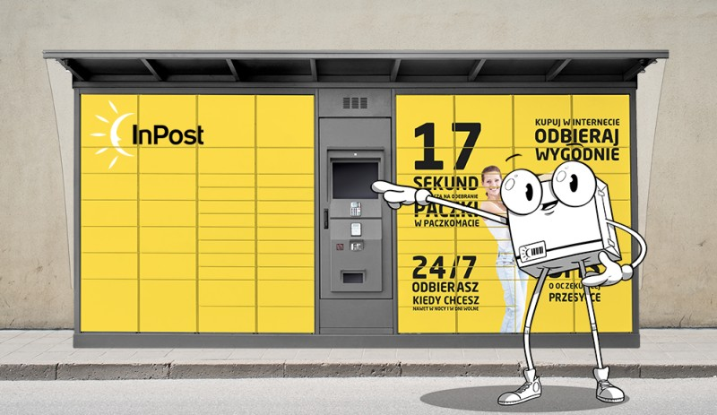

"Odwrócenie sterowania _(ang. Inversion Of Control)_ jedna z fundamentalnych zasad ułatwiających tworzenie reużywalnego kodu i zarządzanie zależnościami w projekcie."

Wiele osób utożsamia ją ze wstrzykiwaniem zależności *(ang. Dependency Injection)*. Jest to jeden z najpopularniejszych sposobów realizacji odwrócenia sterowania. Dziś jednak nie będziemy mówić o wstrzykiwaniu.

## Paczkomaty, a odwrócenie sterowania

Czy przykładów odwrócenia sterowania możemy szukać poza światem programowania? Oczywiście. Poszukiwania ułatwią nam dwa pytania:

- Jak wygląda domyślny proces i co można odwrócić?
- Jakie korzyści przyniesie odwrócenie procesu?

Paczkomaty są dobrym przykładem odwrócenia sterowania. W domyślnym flow listonosz dostarcza paczkę. To on decyduje kiedy ją dostaniemy. Jednak nie zawsze jest to dla nas najlepsza opcja. Możemy być bardzo zajęci i nie mamy możliwości czekać na listonosza cały dzień. Jak można to zmienić? Odwrócić sterowanie!

Decydujemy się na usługę paczkomatów i to my odbieramy paczkę. Nie czekamy, aż zostanie nam dostarczona, tylko sami podejmujemy działanie. Odpowiedzialność z listonosza przenoszona jest na nas. To my decydujemy kiedy chcemy ją odebrać.

Co dzięki temu zyskujemy? Elastyczność i swobodę. Odbierzemy paczkę w dogodny dla nas momencie.



## Kto kontroluje kod

Wróćmy do świata programowania. W tradycyjnym podejściu to kod programisty wywołuje odpowiednie funkcje z bibliotek i steruje wykonaniem programu. Po jego stronie jest odpowiedzialność, kiedy funkcje będą wywołane.

Co, jeśli odwrócimy ten proces? Programista przesyła funkcje do struktury, która steruje ich wywołaniem. Odpowiedzialność za to **kiedy** coś zostanie wywołane, spada na strukturę, programista dostarcza to **co** będzie wywołane.

Definicja z Wikipedii: *paradygmat (czasami rozważany też jako wzorzec projektowy lub wzorzec architektury) polegający na przeniesieniu funkcji sterowania wykonywaniem programu do używanego frameworku. Framework w odpowiednich momentach wywołuje kod programu stworzony przez programistę w ramach implementacji danej aplikacji.*


Co może być takim framework'iem? To już zależy od kontekstu i problemu. Przy próbie odwrócenia sterowania i znalezieniu odpowiedniego framework'a pomocne okażą się pytania, które już dziś zadaliśmy:

- Jak wygląda domyślny proces i co można odwrócić?
- Jakie korzyści przyniesie odwrócenie?

## "Co" i "kiedy"

Bardzo często odwrócenie sterowania osiąga się poprzez:

1. Oddzielenie cześci kodu, który wykonuje jakąś logikę - "co", od mechanizmu, który wyzwala tę logikę - "kiedy"
2. Upewnienie się, że obie części wiedzą o sobie jak najmniej. Dzięki temu rozwiązanie będzie bardziej generyczne np. mechanizm filtrowania, który przyjmuje dowolną funkcję z odpowiednimi parametrami i zwracanym typem boolean

## Przykłady odwrócenia sterowania w Javascript

### Obsługa zdarzeń

Prosty mechanizm obsługi zdarzeń jest przykładem odwrócenia sterowania. Programista przekazuje funkcję _(co)_, która zostanie wywołana w momencie kliknięcia w przycisk _(kiedy)_.

Co dzięki temu zyskujemy? Przenosimy odpowiedzialność za obsługę zdarzeń do zewnętrznego mechanizmu. Nie musimy sami tego implementować.

```html
<button>Click Me</button>

<script>
  // what-to-do
  const showAlert = () => {
    alert("Hi, I'm Alert");
  };

  const button = document.querySelector("button");
  // when-to-do
  button.addEventListener("click", showAlert);
</script>
```

### Funkcje: map, find, filter

Standardowe funkcje takie jak `map`, `find` czy `filter` są kolejnym przykładem odwrócenia sterowania. Funkcje te jako argument przyjmują wyrażenie zdefinowane przez programistę _(co)_, które wykonują dla każdego z elementów kolekcji _(kiedy)_.

Co dzięki temu zyskujemy? Nie musi implementować przechodzenia po elementach kolekcji. Kod jest bardziej opisowy.

Poniżej uproszoczna implementacja funkcji `map` z jej użyciem.

```javascript
Array.prototype.map = function(callback) {
  const resultArray = [];
  for (let index = 0; index < this.length; index++) {
    // when-to-do
    resultArray.push(callback(this[index], index, this));
  }
  return resultArray;
};

// what-to-do
const add10To = element => {
  return element + 10;
};

console.log([1, 2, 3].map(add10To)); // 11, 12, 13
```

### Odwrócenia sterowania w React - Render Props

Zasadę odwrócenia sterowania wykorzystują również popularne rozwiązania jak choćby React. W ramach przykładu zaimplementujmy licznik. Oto początkowa implementacja:

```jsx
import React, { useState } from "react";

const Counter = () => {
  const [count, setCount] = useState(0);

  return (
    <div>
      <button onClick={() => setCount(count + 1)}>Increase</button>
      <button onClick={() => setCount(count - 1)}>Decrease</button>
      <p>Result: {count}</p>
    </div>
  );
};
```

Okazuje się, że po pewnym czasie trzeba dodać do niego kolejne funkcjonalności, którymi są:

- dodanie tytułu i opisu
- możliwość resetowania
- oddzielenie tytułu i opisu od przycisków przez pionową linię
- oddzielenie przycisków od wyniku przez pionową linię

Każda ze wspominanych funkcjonalności ma być opcjonalna. Modyfikujemy kod:

```jsx
import React, { useState } from "react";

const Counter = ({ canReset, description, title, topLine, bottomLine }) => {
  const [count, setCount] = useState(0);

  return (
    <div>
      {title ? <h1>{title}</h1> : null}
      {description ? <p>{description}</p> : null}
      {topLine ? <hr /> : null}
      <button onClick={() => setCount(count + 1)}>Increase</button>
      <button onClick={() => setCount(count - 1)}>Decrease</button>
      {bottomLine ? <hr /> : null}
      <p>Result: {count}</p>
      {canReset ? <button onClick={() => setCount(0)}>Reset</button> : null}
    </div>
  );
};
```

Komponent mimo kilku zmian zaczyna "puchnąć". Obecna implementacja, nie jest jednak wystarczająca. Trzeba dodawać kolejne elementy.

W końcu pojawia się zadanie stworzenia licznika w taki sposób, żeby można było dodać do niego dowolne elementy w dowolnej kolejności. Jak podejść do takiego problemu?

Dobrym rozwiązaniem byłoby stworzenie struktury, do której przekażemy licznik w dowolnej formie, a struktura ta zajmie się logiką i wyrenerowaniem przekazanego licznika. Zaimplementujmy takie rozwiązanie.

Najpierw zajmijmy się komponentem `Counter`. Jego implementacja znacznie się uprościła i polega na wywołaniu funkcji `render` przesłanej jako atrybut.

```jsx
import { useState } from "react";

// highlight-next-line
const Counter = ({ render }) => {
  const [count, setCount] = useState(0);

  // when-to-do
  return render(count, setCount); // highlight-line
};
```

Poniżej mamy utworzenie dwóch liczników wykorzystując `Counter`. Rozwiązanie polega zdefiniowaniu funkcji zwracającej komponent i przypisaniu jej do atrybutu `render`.

Funkcja przyjmuje dwa argumenty, dzięki którym `Counter` może przekazać aktualną wartość licznika `count`, oraz ustawienie licznika `setCount`.

Taki sposób rozwiązania to [Render Props](https://reactjs.org/docs/render-props.html).

```jsx
const Counters = () => {
  return (
    <div>
      <Counter
        render={(count, setCount) => (
        /* what-to-do */
          <div>
            <h1>Simple Counter</h1>
            <button onClick={() => setCount(count + 1)}>Increase</button>
            <p>You clicked {count} times</p>
          </div>
        )}
      />

      <Counter
        render={(count, setCount) => (
        /* what-to-do */
          <div style={{ background: "#eaeaea" }}>
            <h1>Fancy Counter</h1>
            <p>It's super cool counter with decreasing and resetting</p>
            <p>Result: {count}</p>
            <button onClick={() => setCount(count + 1)}>Increase</button>
            <button onClick={() => setCount(count - 1)}>Decrease</button>
            <button onClick={() => setCount(0)}>Reset</button>
          </div>
        )}
      />
    </div>
  );
};}
```

Widzisz co wykorzystaliśmy? Odwróciliśmy sterowanie. O wyrenderowaniu licznika decyduje odpowiednia strukura, a programista definuje tylko wygląd komponentu.

Dzięki takiemu rozwiązaniu zyskujemy na swobodzie, możemy przekazać licznik w dowolnej formie. Poprawiliśmy separację naszych struktur. W tym przypadku:

- warstwa logiki - komopnent `Counter`
- warstwa prezentacji - dowolny komponent przekazany do `Counter`

[Tutaj działająca wersja tego przykładu.](hhttps://codesandbox.io/s/fervent-tharp-pf3ne)

https://codesandbox.io/s/fervent-tharp-pf3ne

## Podsumowanie

Odwrócenia sterowania jest bardzo potężnym narzędziem w świecie programowania. Pozwala na zwiększenie separacji w kodzie, lepsze zarządzanie zależnościami czy ułatwia tworzenie reużywalnych struktur.

Zanim jednak użyje się odwrócenia sterowania należy rozważyć zyski i straty z tym związane. Pomogą Ci w tym już dziś postawione pytania:

- Jak wygląda domyślny proces i co można odwrócić?
- Jakie korzyści przyniesie odwrócenie?
