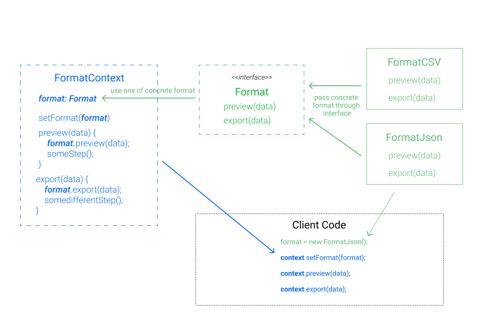
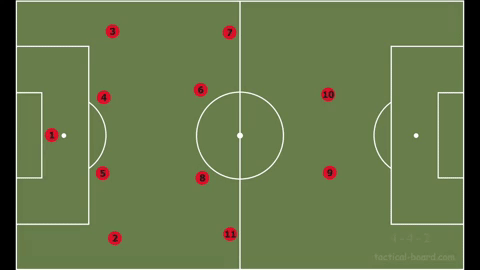

Witam Cię w drugiej części mini serii poświęconej usuwaniu powtórzeń. [W poprzednim poście](https://miscoded.io/pl/blog/subtelne-powtorzenia-polimorfizm/) przedstawiłem przykłady subtelnych powtórzeń oraz możliwości ich usunięcia przy użyciu polimorfizmu, dziś rozszerzymy temat o wzorzec strategii.

Przypomnijmy, że subtelnymi powtórzeniami są:

- łańcuchy instrukcji `switch-case` lub `if-else`, które występują wielokrotnie w różnych miejscach w kodzie, zawsze z tym samym zbiorem warunków
- moduły, które mają podobne algorytmy, ale nie mają podobnego kodu - inaczej mówiąc moduł zawiera pewną listę kroków, jednak w zależności od typu implementacja kroków jest inna

W ramach dzisiejszego postu przygotowałem prostą aplikację w React, która pozwala na stworzenie konfiguracji z pól formularza (imię, nazwisko, wiek).

Konfiguracja taka, może występować w 2 formatach: _json_ i _csv_.

Aplikacja składa się z następujących komponentów:

- formularz do wypełnienia danych konfiguracji `Config`
- wyboru formatu `Format`
- komponentów, które pozwalają podejrzeć `Preview` i wyeksportować `Export` konfigurację w konkretnym formacie

```jsx
import React, { useState } from "react";

import { Config, Format } from "./Forms";
import { Preview } from "./Preview";
import { Export } from "./Export";

import "./styles.css";

export default function App() {
  const [values, setValues] = useState({ name: "", surname: "", age: "" });
  const [format, setFormat] = useState("json");

  return (
    <div className="App">
      <div>
        <Config values={values} setValues={setValues} />
        <Format value={format} setFormat={setFormat} />
      </div>
      <div>
        <Preview format={format} data={values} />
        <br />
        <Export format={format} data={values} />
      </div>
    </div>
  );
}
```

Skupmy się na 2 ostatnich komponentach:

```jsx
/* preview.jsx */
export const Preview = ({ format, data }) => {
  let code = null;
  // highlight-start
  switch (format) {
    case "csv":
      code = <pre className="csv">{generateCSV(data)}</pre>;
      break;
    default:
      code = <pre className="json">{generateJson(data)}</pre>;
  }
  // highlight-end

  return <div>{code}</div>;
};

/* export.jsx */
export const Export = ({ format, data }) => {
  const exportData = () => {
    // highlight-start
    switch (format) {
      case "csv":
        // ...here do some additional steps to export CSV...
        console.log("Do some steps to export CSV");
        alert(generateCSV(data));
        break;
      default:
        // ...here do some additional steps to export JSON...
        console.log("Do some steps to export JSON");
        alert(generateJson(data));
    }
    // highlight-end
  };
  return <button onClick={() => exportData()}>Export configuration</button>;
};
```

W każdym z nich widzimy instrukcję `switch` mającą ten sam zbiór warunków, opierający się o typ formatu. Jeśli czytałeś poprzedni post wiesz, że takie rozwiązanie będzie problematyczne w utrzymaniu.

Z każdym nowym formatem będziemy musieli zmieniać każdą powiązaną instrukcję `switch`. Tutaj są to tylko 2 miejsca, ale w zaawansownej aplikacji byłoby ich zdecydowanie więcej. Jak rozwiązać to lepiej?

Widzimy, że w zależności od typu formatu generowana jest odpowiednia konfiguracja np. `generateCsv`, a następnie wykonywane jakieś dodatkowe kroki.

Moglibyśmy zastąpić każdą z instrukcji `switch` odpowiednią funkcją realizującą konkretną logikę np. `export`, `preview` i zamknąć w nich generowanie danych wraz z dodatkowymi krokami.

Skąd jednak funkcję mają wiedzieć, kiedy wygenerować konfigurację w _csv_, a kiedy w _json_?

Umieścilibyśmy je w odpowiednich klasach odpowiadających formatom np. `FormatCsv` czy `FormatJson` i w nich zaimplementowali szczegóły dla każdego formatu.

Jednak gdzie będzie znajdować się logika, która połączy wybranie odpowiedniego formatu z wykorzystaniem konkretnej klasy?

Potrzebujemy do tego jeszcze jedną klasę, która będzie zarządzać formatami. Nazwijmy ją `FormatContext`. To z nią będa się komunikować inne części systemu i dzięki niej podmienimy używany format w czasie działania programu.

To co właśnie przedstawiłem to wzorzec strategii.



Na powyższym schemacie widzimy interfejs `Format`. Jest on niezbędny w językach statycznie typowanych do określenia zbioru wspólnych typów jakich można używać. W Javascript, gdzie możemy przesłać dowolny obiekt bez sprawdzania typu, nie ma takiej potrzeby.

## Wzorzec strategii, czyli "jak grać panie trenerze?"

Przedstawy sobie jeszcze jego definicję.

_Wzorzec strategii to wzorzec behawioralny opisujący pewne zachowania. Umożliwia on wybór algorytmu w czasie wykonywania programu. Kluczową ideą jest tworzenie obiektów reprezentujących konkretne strategie (implementacje algorytmu). Obiekty te tworzą zbiór strategii spośród których obiekt kontekstu może wybierać i odpowiednio zmieniać swoje zachowanie zgodnie z zastosowaną strategią._

Zanim jednak przejdziemy do kodu krótka analogia do piłki nożnej. W tej dyscyplinie występuje wiele różnych ustawień:

- 4-4-2
- 4-3-3
- 4-1-2-3-1

Każda drużyna (_obiekt kontekstu_) gra z określonym ustawieniem (_strategia_). Jednak w zależności do sytuacji na boisku może ono ulec zmienie np. kiedy drużyna wygrywa może skupić się na bardziej defensywnej grze.

Na tym prostym przykładzie możemy zobaczyć jak istotna jest możliwość zmiany rozwiązania.

<figure style="width: 100%; margin-left: 0;">
  <a href="assets/formations.gif">  
    
  </a>
  <figcaption>Rożne strategie gry zespołu (źródło: https://tactical-board.com/uk/big-football)</figcaption>
</figure>

## Wzorzec strategii, a powtórzenia

Wracając do naszego przykładu, przypomnijmy, że chcemy stworzyć zbiór strategii bazujących na formatach. W zależności od przyjętej strategii inaczej zostanie zrealizowany podgląd oraz eksport.

Zdefinujmy zbiór strategii:

```javascript
export class FormatJson {
  type = "json";

  exportData(data) {
    // ...here do some additional steps to export JSON...
  }

  preview(data) {
    // ...here do some additional steps to export JSON...
  }

  generate(data) {
    // ...here logic to generate JSON...
  }
}

export class FormatCSV {
  type = "csv";

  exportData(data) {
    // ...here do some additional steps to export CSV...
  }

  preview(data) {
    // ...here do some additional steps to preview CSV...
  }

  generate(data) {
    // ...here logic to generate CSV...
  }
}
```

W każdej z klas mamy funkcje implementujące generowanie konfiguracji w określonym formacie, eksport oraz podgląd.

**Powoduje to ukrycie szczegółów przed innymi częściami systemu, co zmniejszy liczbę miejsc, które trzeba będzie modyfikować np. dodając nowy format.**

Zdefiniujemy sobie teraz nasz `FormatContext`, z racji użycia React'a będzie on nietypowy. Nie będzie to klasa, a react hook.

```js
const formats = {
  csv: new FormatCSV(),
  json: new FormatJson(),
};

export function useFormat(intialValue) {
  const [type, setType] = useState(intialValue);

  return {
    type,
    setType,
    format: formats[type],
  };
}
```

W tej krótkiej funkcji zawarliśmy całą logikę odpowiedzialną za wybór odpowiedniej strategii (formatu). Teraz zwracany format należy przekazać do odpowiednich komponentów, w których wcześniej były instrukcje `switch`

```jsx
/* export.jsx */
export const Export = ({ format, data }) => {
  return (
    <div>
      <button onClick={() => format.exportData(data)}>
        Export configuration
      </button>
    </div>
  );
};

/* preview.jsx */
export const Preview = ({ format, data }) => {
  return <div>{format.preview(data)}</div>;
};
```

Szczegóły dotyczące formatów zostały ukryte, dzięki temu komponenty stały się bardzo małe. Pozostaje nam już tylko użyć hook'a w głównym komponencie

```jsx
export default function App() {
  const [values, setValues] = useState({ name: "", surname: "", age: "" });
  const { type, setType, format } = useFormat("json");

  return (
    <div className="App Grey">
      <h3>Strategy pattern solution</h3>
      <div>
        <Config values={values} setValues={setValues} />
        <Format value={type} setType={setType} />
      </div>
      <div>
        <Preview format={format} data={values} />
        <br />
        <Export format={format} data={values} />
      </div>
    </div>
  );
}
```

[Tutaj znajdziesz cały omówiony kod.](https://codesandbox.io/s/configurator-uupb4)

https://codesandbox.io/s/configurator-uupb4

Główną zaletą tej refaktoryzacji jest ukrycie logiki powiązanej z formatami, węwnątrz odpowiednich klas. Teraz, chcąc dodać kolejny format nie będziemy musieli edytować naszego kodu w wielu miejscach, wystarczy dodać nową klasę (_strategię_) np. `HTMLFormat` i rozszerzyć obiekt `formats` (z którego korzysta `useFormat`) o nowy typ.

## Kalkulacja i refaktorzyacja, nie odwrotnie

Wzorce projektowe (strategia nie jest tu wyjątkiem) są tylko pewnymi narzędziami do rozwiązywania problemów. Zanim go użyjemy należy rozważyć czy przyniesie to więcej plusów niż minusów.

Minusami takiego rozwiązania jest większa złożoność należy dodać choćby klasę pośredniczącą `Context`, dodatkowo inne osoby w zespole muszą znać ten wzorzec, żeby rozumieć co dzieje się w kodzie.

## Podsumowanie

Jak pisałem w poprzednim poście tej mini serii "Powtórzenia to nie tylko fragementy identycznego kodu. Często kryją się pod instrukacjami `if-else` i `switch-case` rozsianymi po całej aplikacji." Dziś poznaliśmy wzorzec strategii, które pomoże w usunięciu tego rodzaju powtórzeń.

Jest on szczególnie przydatny w przypadku kiedy mamy kilka modułów składających się z tych samych kroków, ale szczegóły kroków powinny być zaimplmentowane w inny sposób w każdym z modułów.

Pamiętaj, że nie jest to złoty środek, przed zastosowaniem jakiegokolwiek wzorca należy rozważyć plus i minusy jego użycia. Tylko wtedy będziesz w stanie podnieść jakość swojego kodu.
