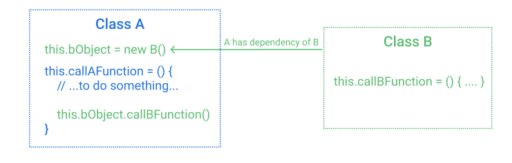

Kontynuujemy temat [poprzedniego postu](https://miscoded.io/pl/blog/odwrocenie-sterowania/) dotyczący zasady odwrócenia sterowania. Dziś czas na jej najpopularniejszą implementację zwaną wstrzykiwaniem zależności.

Zwiększa ona elastyczności struktur w naszej aplikacji. To z kolei pozwala łatwiej wprowadzać modyfikacje i szybciej odpowiadać na pojawiające się zmiany wymagań, bardzo częste programowaniu.

Jednak czy problem z zależnościami dotyczy tylko programistów?

## Sport i problemy z zależnościami

Wyobraźmy sobie trenera sportu drużynowego, który ustala skład na turniej. Sukces drużyny zależy od tego, w jakiej formie będą zawodnicy i jak będzie wyglądała ich współpraca. Drużyna jako struktura uzależniona jest od poszczególnych elementów - zawodników.

Pomyślmy o trenerze Brzęczku przygotowującym się na Euro ~~2020~~ 2021. Jego drużyna musi składać się z:

- bramkarza
- obrońców
- pomocników
- napastników

Są to **ogólne** pozycje, na które trener musi wybrać **konkretnych** piłkarzy.

Nie ma u nas problemu z bramkarzem. W zależności od sytuacji może nim być Szczęsny czy Fabiański. **Trener nie jest uzależniony od jednego, konkretnego wyboru**.

Inaczej w ataku, tam jedno miejsce jest zarezerwowane dla konkretnego piłkarza - Lewandowskiego - od którego nasza reprezentacja **jest uzależniona**.

Kiedy to będzie problem? W momencie, w którym zakończy on karierę lub dozna kontuzji. Jest go bardzo trudno zastąpić, bo spoczywa na nim **dużo odpowiedzialności**.


Podsumowując, w momencie budowania struktury, nie powinna być uzależniona od konkretnych obiektów. **Ważne, żeby mieć możliwość ich dopasowania i podmiany w zależności od wymagań.**

Jak przenieść to do świata programowania?

## Zależność w programowaniu

Zacznijmy od zdefiniowania zależności w programowaniu.

Mamy klasę `A` oraz `B`.

Klasa `A` do działania wykorzystuje obiekt klasy `B`. Oznacza to, że klasa `A` polega na klasie `B`, innymi słowy klasa `B` jest zależnością klasy `A`.



## Wstrzykiwanie zależności

Jak wspomniałem wstrzykiwanie zależności, jest implementacją odwrócenia sterownia. Kiedy chcemy zastosować odwrócenie sterowania, warto zadać sobie dwa pytania:

- Jak wygląda domyślny proces i co można odwrócić?
- Jakie korzyści przyniesie odwrócenie procesu?

Czym jest domyślny proces, jeśli chodzi o tworzenie zależności?

Polega on na tym, że klasa definiuje jakich zależności potrzebuje. Rozważmy kod zajmujący się budową samochodu w ramach domyślnego procesu.

> W poniższym przykładzie świadomie operuje na prototypach, nie klasach. Javascript oparty jest na prototypach, a klasy to tzw. _syntactic sugar_ - ukłon w stronę języków obiektowych. Przykład ten pokazuje, że wstrzykiwanie zależności może być użyte bez konstrukcji `class`.

Poniżej widzimy definicję funkcji `Car`, która sama określa jakich zależności potrzebuje. W tym przypadku to obiekt typu `Engine`.

```javascript
function Car() {
  // concrete type of object - lost flexibility
  this.engine = new Engine();
}

Car.prototype.start = function() {
  if (this.engine) {
    this.engine.start();
  }
};

function Engine() {
  this.horsepower = 64;
}

Engine.prototype.start = function() {
  console.log("Engine with " + this.horsepower + " hp has been started...");
};

const car = new Car();
car.start(); // "Engine with 64 horsepower has been started..."
```

Co powoduje problemy w tym kodzie? Uzależnienie `Car` od `Engine`. To ograniczenie nie pozwala nam zbudować samochodu z mocniejszym/słabszym silnikiem, jego moc jest zawsze taka sama, równa 64. Jak lepiej podejść do tego rozwiązania?

Odwrócić sterowanie! Jeśli domyślnym procesem było zdefiniowanie konkretnej zależności wewnątrz funkcji, odwracamy to i dostarczamy do funkcji potrzebną zależność z zewnątrz:

```javascript
function Car(engine) {
  // highlight-next-line
  this.engine = enigne; // general object, passed from outside
}

Car.prototype.start = function() {
  if (this.engine) {
    this.engine.start();
  }
};

function Engine() {
  this.horsepower = 64;
}

function FastEngine() {
  this.horsepower = 128;
}

// we build dependency here - outside Car
const car = new Car(new Engine());
const fastCar = new Car(new FastEngine());
```

Co dzięki temu zyskaliśmy? Swobodę. W tym przykładzie to tworzenie samochodów z silnikami o różnej mocy. Nie jesteśmy już uzależnieni od jednego, konkretnego.

Jednak wciąż nie jest to rozwiązanie idealne. Musimy pamiętać o prawidłowej kolejności wywołań `Engine` lub `FastEngine` przed `Car`. Jak rozwiązać to w sposób jeszcze bardziej elastyczny, tak żeby nie martwić się o kolejność?

Zacznijmy od zasady odwrócenia zależności, która jest następująca:

> _Moduły wysokopoziomowe nie powinny zależeć od modułów niskopoziomowych. Zależności między nimi powinny wynikać z abstrakcji._

Czym są te poziomy wysokopoziome i niskopoziomowe?

Moduły wysokopoziomowe to takie która mają mało szczegółów i służą do komunikacji z innymi częściami systemu. W języku czysto obiektowym np. C# to interfejsy zwierające tylko zbiór potrzebnych metod bez ich implementacji.

Moduły niskopoziomowe to konkretne klasy zawierające szczegóły implementacji.

Hmm, ale jak stworzyć takie wysokopoziomowy moduł w języku Javascript kiedy nie możemy używać interfejsów?

Wykorzystajmy w tym celu wstrzyknięcie zależności używając do tego tzw. kontenera DI (dependncy injection) - biblioteki `injector.js`. Dzięki niej możemy wprowadzić podział na wysoko i nisko poziomowe moduły. Jak to działa w praktyce?

Programista definuje wysokopoziomowy moduł `IEngine` jak zależność `Car`, następnie "informuje" kontenter, że za każdym razem, gdy ktoś poprosi o moduł `IEngine` przekaż mu konkretną implementację (moduł niskopoziomowy) np. `FastEngine`.

W tym celu należy połączyć wysokopoziomowy - `IEngine` z niskopoziomowym - `FastEngine`. Robimy to przez tzw. rejestrację. Przykładowy kod z opisem działania poniżej.

```javascript
import Injector from "js.injector";

const DIContainer = new Injector();

export function Engine() {
  this.horsepower = 64;
}

Engine.prototype.start = function() {
  console.log("Engine with " + this.horsepower + " hp has been started...");
};

export function FastEngine() {
  this.horsepower = 128;
}

FastEngine.prototype.start = function() {
  console.log("Engine with " + this.horsepower + " hp has been started...");
};

// highlight-start
DIContainer.register({
  IEngine: Engine,
});
// highlight-end

export function Car(IEngine) {
  // highlight-start
  const injected = DIContainer.inject(this.constructor);
  this.engine = injected.IEngine;
  // highlight-end
}

Car.prototype.start = function() {
  if (this.engine) {
    this.engine.start();
  }
};

const car = new Car(); // highlight-line
car.start(); // Engine with 64 hp has been started..."
```

W powyższym przykładzie widzimy powiązanie wysokopoziomowego modułu `IEngine`, z niskopoziomową implementacją `Engine` w liniach 21-23.
Następnie w linii 25-26, mamy wykorzystanie tego wysokopoziomowego modułu jako zależność dla `Car`. W tym przypadku prosząc o `IEngine` dostaniemy obiekt `Engine`.

Zwróć uwagę na linię 35, mimo, że `Car` wymaga od nas dostarczenia zależności w konstrukutrze, tworzymy obiekt z pusta listą argumentów, kontener DI zatroszczył się o zapewnienie odpowiedniej implementacji dla zależności `Car`.


## Odwrócenie zależności i testy - dobrana para

Bardzo często o wstrzykiwaniu zależności mówi się przy okazji testów. To właśnie dzięki swobodzie jaką zyskujemy, wprowadzając wstrzykiwanie, możemy testować komponenty naszej aplikacji, izolując je od innych.

Praktyczny przykład to funkcjonalność wykorzystująca zewnętrzne API. W ramach testów nie chcemy odpytywać zewnętrznego API. Powody to:

- dodatkowe koszty związane z odpytaniem np. używając API w którym płaci się za każdy request
- wydłuzenie czasu testowania
- uzależnienie testu od API. Jeśli serwer wystawiający API ulegnie awarii test nie przejdzie, mimo poprawnego kodu z naszej strony

### Mockowanie API

Rozważmy przykład, w którym chcemy pobrać listę użytkowników z zewnętrznego serwisu `UserService`, a następnie na podstawie pobranych użytkowników utworzyć elementy listy - tagi `li`.

Zaimplementujmy rozwiązanie bez wstrzykiwania zależności:

```javascript
/* view.js */
import { UserService } from "./user_service";

export class View {
  constructor() {
    this.userService = UserService();
  }

  async createUserList() {
    const users = await this.userService.getUser();

    return users.map(user => {
      const li = document.createElement("li");
      li.innerHTML = user.name;

      return li;
    });
  }
}

/* main.js */
import { View } from "./views";

const list = document.getElementById("list");
const usersView = new View();

usersView.createUserList().then(domElement => {
  list.appendChild(domElement[0]);
});
```

Widzimy tutaj klasę `View`, która pobiera użytkowników z serwisu, a następnie na ich podstawie buduje elementy listy. W tym momencie implementacja realizuje swoje zadanie, ale występuje problem z brakiem elastyczności.

`View` jest zależne `UserService`. Co, jeśli chcielibyśmy podmienić go w momencie działania programu albo napisać testy?

```javascript
// view.test.js
import { View } from "./views";

describe("UserView", function() {
  test("render list of users as 'li' elements", async () => {
    const view = new View();

    // function uses external service
    const usersList = await view.createUserList();

    // what should be a value of length?
    // length depends on external UserService
    expect(usersList.length).toBe(1);
  });
});
```

Mamy problem. Klasa `View` jest zależna od zewnętrznego serwisu, którego nie możemy kontrolować. Tym samym tracimy kontrolę również nad testem i pewność, że nasza funkcjonalność działa. Jak to rozwiązać?

Możemy stworzyć klasę `View` której w argumencie przekażemy serwis, na którym będzie operować. Dzięki temu zyskujemy elastyczność. Z łatwością możemy dodać mockowy serwis dla testów:

```javascript
// view.js
export class DIView {
  // highlight-start
  constructor(userService) {
    this.userService = userService;
  }
  // highlight-end

  async createUserList() {
    const users = await this.userService.getUser();

    return users.map(user => {
      const li = document.createElement("li");
      li.innerHTML = user.name;

      return li;
    });
  }
}

// view.test.js
import { DIView } from "./views";

  test("render users list for DI View", async () => {
    const mockUsers = [{ name: "mock-user-1" }, { name: "mock-user-2" }];
    // highlight-start
    const MockUserService = {
      getUser: () =>
        new Promise(function(resolve) {
          resolve(mockUsers);
        })
    };
    // highlight-end

    // highlight-next-line
    const view = new DIView(MockUserService); // pass mocked dependency

    const usersList = await view.createUserList();

    // we are sure about the result. It doesn't depends on external service
    expect(usersList.length).toBe(mockUsers.length);
  });
});
```

Pełen przykład znajdziesz [tutaj](https://codesandbox.io/s/unruffled-williamson-fw079)

https://codesandbox.io/s/unruffled-williamson-fw079

## Dodatkowy koszt

Wstrzykiwanie zależności ma również swój koszt. Jest trudniejsze do zrealizowania niż rozwiązanie w tradycyjnym przepływie. Powoduje podniesienie progu wejścia, szczególnie dla nowych programistów w projekcie.

Decydując się na zastosowanie wstrzykiwania zależności, należy policzyć zyski i straty płynące z zastosowania tego podejścia w naszym rozwiązaniu.

## Wstrzykiwanie zależności w React

### Składnia JSX

Popularne rozwiązania implementują wstrzykiwanie zależności w różny sposób. React nie jest tu wyjątkiem. JSX zapewnia wstrzykiwanie zależności bez wprowadzania dodatkowych mechanizmów.

Najprostszym przykładem są react'owe propsy. Dzięki nim do komponentu możemy przesłać różne dane w tym...inne komponenty. Bardzo dobry przykładem może być artykuł: [One simple trick to optimize React re-renders](https://kentcdodds.com/blog/optimize-react-re-renders).

To co dla nas jest istotne w kontekście wstrzykiwania zależności to sposób przekazania konkretnej instancji komponentu `Logger` jak `prop`. Poniżej kod z tego artykułu. W linii 18 możemy zobaczyć przesłanie komponentu.

```jsx
function Logger(props) {
  console.log(`${props.label} rendered`);
  return null; // what is returned here is irrelevant...
}

function Counter(props) {
  const [count, setCount] = React.useState(0);
  const increment = () => setCount(c => c + 1);
  return (
    <div>
      <button onClick={increment}>The count is {count}</button>
      {props.logger}
    </div>
  );
}

ReactDOM.render(
  <Counter logger={<Logger label="counter" />} />, // highlight-line
  document.getElementById("root")
);
```

### Context API

Przy okazji przekazywania zależności warto wspomnieć o `Context API`. Pozwala ono na przesłanie danych do każdego komponentu niezależnie od poziomu zagnieżdzenia.

Jest to szczególne przydatne w sytuacji w której chcielibyśmy przekazać informację z jednego źródła do kilku komponentów w odrębnych miejsach w strukturze aplikacji. Przykłady to:

- wybrany przez użytkownika motyw np. "light/dark"
- język aplikacji i jej tłumaczenie

## Podsumowanie

Wstrzykiwanie zależności to technika zdecydowania warta uwagi, pozwala na tworzenie reużywalnych, elastyczny rozwiązań. Prowadzi to tworzenia aplikacji, które łatwo się modyfikuje.

Jednak jak w przypadku każdego narzędzia, przed jego użyciem go warto zadać sobie pytanie - "dlaczego?". Dlaczego warto tego użyć i jakie benefity przyniesie mi zastosowanie wstrzykiwania zależności?
