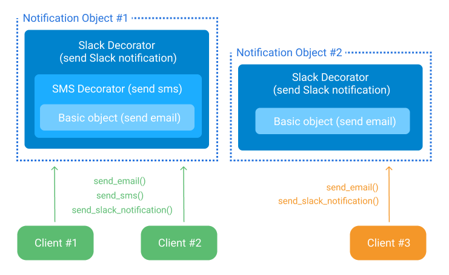

_Poniedziałek. Szary i ponury. Ten z poniedziałków, które najchętniej przeleżałbyś w łóżku. W drodze do pracy zaskoczył Cię deszcz. Okazało się, że ekspres do kawy nie działa. Zastanawiasz się, czy może być gorzej. Wtedy dostajesz zadanie: musisz dodać nowy formularz w jednym z pierwszych widoków aplikacji. Nogi uginają się pod Tobą, na skroni pojawia się pot, już wiesz, że ten dzień będzie gorszy. Wielokrotnie słyszałeś o tej części projektu. Ten kod...każdy mówi o nim z przerażeniem. Wielu programistów prosiło o jego przepisanie, niestety nie ma czasu i budżetu. Każdy, kto pracował z tym kodem, jest już dawno poza firmą, nie potrafili tego znieść...teraz czas na Ciebie._

W tej podkolorowanej historii znajdziemy prawdę o dwóch rzeczach: zmianach i konieczności utrzymania czystego kodu. Nieustannie aktualizujemy nasz kod. Dodajemy nowe funkcjonalności, usuwamy zbędne rzeczy.

Pytanie, co zrobić, aby przy takiej częstotliwości zmian produkować wysokiej jakości kod?

Każdy dobry programista posiada zestaw narzędzi pozwalających na tworzenie takiego kodu, a jedno z nich to wzorce projektowe.

## Wzorce projektowe, czyli co?

Implementujesz rozwiązanie pewnego problemu. Okazuje się, że koncepcja którą wymyśliłeś jest tak dobra, że wszyscy w pracy używają jej do rozwiązania podobnych problemów. Wreszcie Twój pomysł wychodzi poza firmę. Jest tak świetny, że staje się szablonem, którego używają programiści na całym świecie. Takie rozwiązanie nazwiemy wzorcem projektowym.

Tutaj bardziej formalne tłumaczenie: _wzorzec projektowy jest ogólnym rozwiązaniem często występującego problemu w projektowaniu oprogramowania. Nie jest gotowym projektem lecz szablonem, który można przekształcić bezpośrednio w kod._

Dlaczego nie możemy uznać go za gotowe rozwiązanie?

Programiści rozwiązują problemy w różnych środowiskach, choćby świat Frontendu i Backendu. Różnice te powodują inne podejście do implementacji. Warto jednak znać szablony rozwiązań niezależnie od środowiska czy języka.

## Jeden wzorzec, różne implementacje

W ramach przykładu zaimplementujemy wzorzec dekoratora (ang. Decorator Pattern). Omówimy jego definicję, po czym przejdziemy do przykładów użycia.

Użyjemy języka Python i popularnej javascriptowej biblioteki React. Zdecydowałem się na takie rozwiązanie, żeby pokazać różne sposoby implementacji tego wzorca.

### Dekorator - definicja

Wzorzec pozwalający na rozszerzenie obiektu o nowe funkcjonalności, bez wprowadzania zmian w jego kodzie.

Polega na umieszczeniu podstawowego obiektu w specjalnych "opakowaniach" dodających do niego nowe funkcjonalności.

Zaletami tego wzorca są:

- podzielenie logiki na reużywalne warstwy
- dynamiczne dodanie lub usunięcie funkcjonalności w czasie działania programu
- dodanie kilku zachowań do jednego obiektu poprzez użycie wielu dekoratorów

### System notyfikacji

Wyobraź sobie, że budujesz system notyfikacji. Wymagania to:

- każdy z klientów musi dostać powiadomienie na email
- dodatkowo, można wysłać powiadomienie smsem lub/i na Slack

Jest to problem, który łatwo rozwiążemy używając dekoratora.

Podstawowy obiekt, dostarczający powiadomienia poprzez email, możemy rozszerzyć dodając do niego powiadomienia Slack (SlackDecorator) oraz smsy (SMSDecorator), a następnie tak przekształcony obiekt przypisać go do odpowiedniej grupy klientów. Schemat takiego rozwiązania poniżej:



### Uzbrajamy samchód

Jak użyć dekoratora w prawdziwym świecie? Posłużymy się samochodem. Wyobraź sobie, że chcesz umieścić na swoim samochodzie karabin. No co? W końcu czasy takie niepewne i niezpiecznie...

Samochód _(obiekt podstawowy)_ odwozisz do warsztatu _(dekorator)_. W warsztacie montują karabin _(nowa funkcjonalność)_ na dachu samochodu, ale w takim sposób, że będziesz go mógł w każdej chwili usunąć.

W tym momencie masz samochód, którego konstrukcja wewnętrzna w żaden sposób się nie zmieniła. A na jego dachu znajduje się karabin. Czy teraz czujesz się bezpiecznie?

<figure>
    
  <figcaption>Jak zastosować dekorator w prawdziwym świecie...</figcaption>
</figure

### Logowanie wywołań

Wróćmy do świata programowania. Załóżmy, że dostałeś zadanie, które polega na logowaniu wywołań funkcji. Nowa funkcjonalność ma być dodawana dynamicznie, podczas wykonywnia kod (runtime). Jak podszedłbyś to takiego problemu?

Poniżej znajduje się implementacja rozwiązania w Pythonie, opierając się o dekorator. Miej na uwadze, że jest to najprostszy wręcz prymitywny sposób. Przedstawiam tu tylko koncepcję bez dodatkowych złożoności.

Kod dzieli się na:

- funkcje `say_hello` który zgodnie z definicją jest naszym obiektem podstawowym
- dekorator `log_decorator` przyjmuje funkcję jako parametr i zwraca ją wraz z dodatkową funkcjonalnością - _wypisanie informacji bezpośrednio przed i po wywołaniu funkcji_. Patrząc na definicję jest to nasze opakowanie, które dodaje nową funkcjonalność do podstawowego obiektu

```python
def log_decorator(func):
    # returned object with extended functionality
    def wrapper():
        print("Before the function is called.")
        func()
        print("After the function is called.")
    return wrapper

def say_hello():
    print("Hello!")

say_hello_with_logs = log_decorator(say_hello)

# Console:
# > Before the function is called
# > Hello
# > After the function is called
say_hello_with_logs()
```

### Pobieranie danych

Kolejne zdanie, tym razem w React. Potrzebujesz funkcjonalność, która rozszerzy komponent o możliwość pobierania danych.

Dla uproszczenia przyjmijmy, że na kliknięcie pobieramy losowy cytat. Rozwiązanie musi być reaużywalne, pozwalające roszerzyć dowolny komponent.

Jedno z potencjalnych rozwiązań to Higher-Order Components (HOC). Jest to oczywiście implementacja wzorca dekoratora w React.

Poniżej mamy dwa kontentery w których umieścimy cytaty:

```jsx
// quoteContainers.jsx
import React from "react";

export const Paragraph = ({ quote, onRequest }) => (
  <div>
    <p>Paragraph: {quote}</p>
    <button onClick={onRequest}>Click for new quote!</button>
  </div>
);

export const Title = ({ quote, onRequest }) => (
  <div>
    <h1>Title: {quote}</h1>
    {/* ...super fancy stuff here */}
    <button onClick={onRequest}>Click for new quote!</button>
  </div>
);
```

Widzimy, że są one bardzo proste i służą jako warstwa prezentacji i interakcji z użytkownikiem (kilknięcie przycisku). Nie mają nic wspólnego z przetworzeniem danych, takich jak pobranie cytatu.

Dalej mamy implementację dekoratora. Dostarcza on podstawowemu komponentowi dodatkową funkcjonalność. Jest to cytat, oraz handler, który zostanie wywołany podczas kilknięcia w przycisk.

Plusy zastosowania wzorca? Rozdzielenie logiki. W tym przypadku na:

- warstwę prezentacji
- warstwę logiki, czyli wysłanie zapytania, pobranie jego wyniku i przekazanie do warstwy prezentacji

Kolejnym zaletą jest brak sztywnych zależności. Komponent `withQuote` interesuje tylko przekazanie cytatu oraz handlera. Nie wie nic o strukturze komponentu który rozszerza, dzięki temu może być w łatwy sposób używany wielkokrotnie.

```jsx
// withQuote.jsx
import React, { Component } from "react";
import { getQuote } from "../server/quotes-provider";

export const withQuote = WrappedComponent => {
  // returned object with extended functionality
  class ExtendedComponent extends Component {
    state = {
      quote: "No quote",
    };

    onRequest = () => {
      const { quoteText } = getQuote();
      this.setState({ quote: quoteText });
    };

    render() {
      return (
        <WrappedComponent
          {...this.props}
          quote={this.state.quote}
          onRequest={this.onRequest}
        />
      );
    }
  }

  return ExtendedComponent;
};
```

[Tutaj znajdziesz działajacą wersje](https://codesandbox.io/s/dreamy-cerf-2xy8x):

https://codesandbox.io/s/dreamy-cerf-2xy8x

Zwróć uwagę na Python'ową funkcję `log_decorator`, oraz component `withQuote`. Dostrzegasz identyczną strukturę rozwiązań?

Przesłanie obiektu podstawowego jako argumentu i zwrócenie rozszerzonego obiektu.

## Niech Twój kod przemówi

Dobry kod powinien nieść jak najwięcej informacji dla czytelnika. Pokazywać intencje autora.

Źródłem takich informacji są wzorce. Jeśli ktoś analizuje kod i widzi użycie wzorca, który zna, **łatwiej zdobędzie szerszy kontekst, szybciej zrozumie i odczyta intencje autora**.

Posłużymy się wspomnianym dekoratorem. Powiedzmy, że programista przegląda kod projektu w React. Trafia on na instrukcję:

```javascript
const EnhancedComponent = higherOrderComponent(WrappedComponent);
```

Jeśli zna koncepcję HOC, wie, że kod rozszerza `WrappedComponent`. Wnioskuje, że autor chciał ukryć pewną powtarzalną logikę, a następnie rozszerzać o nią inne komponenty. Dzięki temu może łatwo przeanalizować co to za logika i czy będzie przydatna np. w ramach zmian, które wprowadza.

## To tylko narzędzie

"Człowiekowi z młotkiem wszystko wydaje się gwoździem" jest bardzo trafnym stwierdzeniem w programowaniu. Bardzo często przywiązujemy się do jakiegoś rozwiązania tak mocno, że wszędzie widzimy jego zastosowanie. Tyczy się to również wzorców projektowych. Musimy pamiętać, że to tylko narzędzie. Dla jednych problemów jest idealne, dla innych nie. Jest dodatkową warstwą abstrakcji w kodzie, co może zwiększyć próg wejścia szczególnie dla osób nieznających tego wzorca.

Skąd wiedzieć, kiedy warto zastosować jakiś wzorzec? Przed wprowadzeniem określonego rozwiązania porównaj korzyści i straty, jakie wprowadza. Taką stratą może być wzrost złożoności kodu czy wydłużenie czasu analizowania kodu przez osoby, które takiego wzorca nie znają. Zapytaj członków zespołu, co sądzą o zastosowaniu określonego wzorca.

_Pamiętaj, kod to też narzędzie komunikacji, nie utrudniaj jej, dodając rzeczy, które tylko Ty rozumiesz._

## Nie wkuwaj, używaj

Jak podejść do nauki wzorców? Istnieje biblia dotczyąca wzorców programowania obiektowego _"Design Patterns: Elements of Reusable Object-Oriented Software"_. Jednak jest to pozycja dość ciężka, napisana przez osoby z otoczenia akademickiego.

Zdecydowanie lepszą alernatywą jest strona: https://refactoring.guru/design-patterns.

Jednak uważam, że wkuwanie diagramów UML, definicji i sposóbów użycia nie jest dobre. **Najlepiej ucz się wzorców wykorzystując je w praktyce**.

Programując w React, nie użyjesz większości wzorców z programowania obiektowego. Nawet jeśli nauczysz się ich na pamięć, po pewnym czasie nieużywania, zapomnisz o większości. Trochę strata czasu co?

Pisząc aplikację w React, sprawdź wzorce związane z tą biblioteką `react design patterns`. Ich poprawne użycie sprawi, że jakość Twojego kodu zwiększy się, a koncepcje za nim stojące staną się dla Ciebie proste i naturalne.

W skrócie: dowiedz się o narzędziach dostosowanych do Twoich problemów, a następnie je wykorzystaj.

## Podsumowanie

Wzorce projektowe są jednym z niezbędnych narzędzi programisty. Jednak jak w przypadku każdego narzędzia należy rozważyć plus i minusy stojące za ich użyciem. Jeśli dobrze je przeanalizujesz i odpowiednio zastosujesz wzorce, jakość i czytelność tworzonych przez Ciebie rozwiązań zwiększą się diametralnie.
