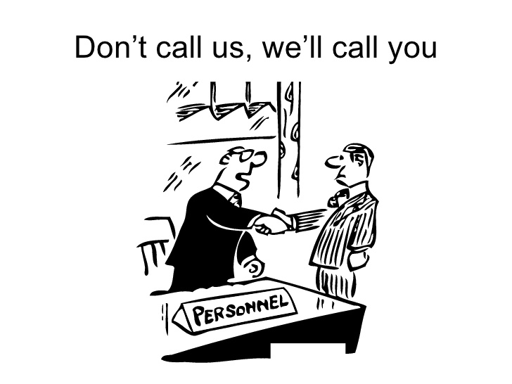
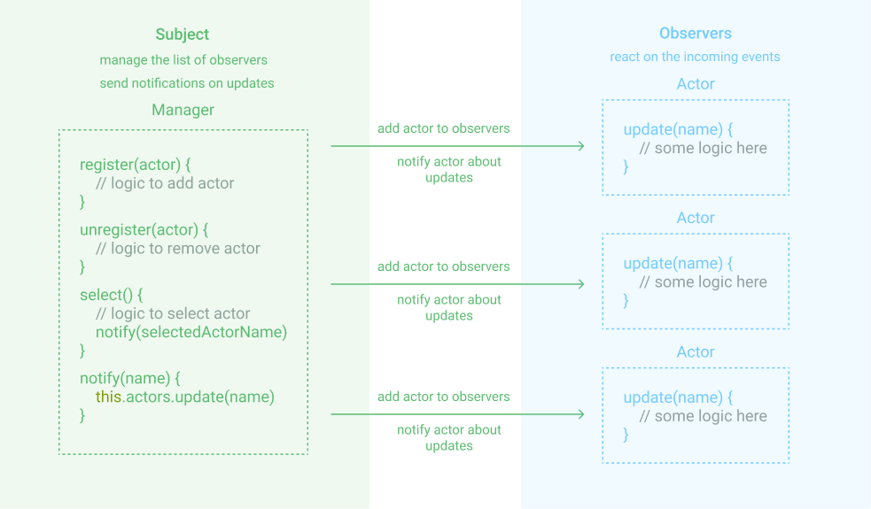

Wzorce projektowe to istotny element tworzenia oprogramowania. Dla programisty są narzędziami pozwalającymi łatwiej rozwiązać pewne klasy problemów. Czasem się przydadzą, czasem nie, a w większość sytuacji potrzebujemy tylko kilku z nich. Dziś o narzędziu, które należy do wspomnianej grupy, jest szeroko używane w wielu rozwiązaniach - wzorzec obserwatora _(ang. Observer Pattern)_.

Większość osób nie zdaje sobie sprawy jak często go wykorzystuje. Chcesz zapisać się do newsletter'a? Może czekasz na informację o statusie Twojego zamówienia? To przykłady zastosowania tego wzorca.

Dorzućmy jeszcze jeden przykład, paczkomaty. Wcześniej należało czekać za listonoszem lub kurierem, który przynosił paczkę do domu. Teraz sytuacja odwróciła się i to Ty odbierasz paczkę. Reagujesz na informację o statusie Twojego zamówienia, jesteś obserwatorem.

Dzięki odwróceniu sytuacji zyskujemy na swobodzie, możemy odebrać paczkę w dogodnym dla nas momencie.

Widzisz tutaj jakiś koncept? Podpowiem: odwrócenie sterowania. Wzorzec obserwatora jest właśnie przykładem tego konceptu. Jeśli chcesz dowiedzieć sie więcej o odwróceniu sterowania i korzyściach z niego płynących zapraszam [tutaj](https://miscoded.io/pl/blog/odwrocenie-sterowania/).

## Co mają wspólnego Hollywood i programowanie?

Jeśli przeczytałeś wspomniany artykuł wiesz, że przy odwróceniu zależności pomocne okażą się dwa pytania:

- Jak wygląda domyślny proces i co można odwrócić?
- Jakie korzyści przyniesie odwrócenie?

Jak to ma się do obserwatora?

Bardzo często w kontekście odwrócenia sterowania używa się zasady Hollywood: **“Don’t Call Us, We’ll Call You.”**



Przenealizujmy przykład bazując na tej zasadzie.

Pewne studio robi casting do filmu. Zgłosiły się setki kandydatów. Każdemu z nich bardzo zależy na roli w filmie, czy w związku z tym powinien co 5 minut dzwonić do studia i pytać o wyniki?

Nie jest do dobre podejście zarówno z perspektywy kandydata (jest zajęty telefonami) jak i studia (musi odbierać telefony). To jest nasz domyślny proces. Jak możemy go usprawnić?

**Odwróćmy sterowanie**, to studio poinformuje zainteresowanych o wynikach, w końcu "Nie dzwoń do nas, to my zadzwonimy do Ciebie".

Aktorzy z stali się obserwatorami (czy raczej słuchaczami) reagującymi dopiero po otrzymaniu komunikatu.

Przenalizujemy sobie schemat omówionego problemu.



Mamy tutaj managera odpowiedzialnego za:

- zarządzadzanie listą potencjalnych kandydatów (dodawanie i usuwanie)
- informowanie kandydatów o wszystkich uaktualnieniach dotyczących obsady

Odpowiedzialnością aktora jest tylko reakcja na informację, które otrzymał od managera.

Oto cały wzorzec obserwatora! Uogólnijmy go i dodajmy definicje.

## Definicja

> _"Obserwator to czynnościowy (behawioralny) wzorzec projektowy pozwalający zdefiniować mechanizm subskrypcji w celu powiadamiania wielu obiektów o zdarzeniach dziejących się w obserwowanym obiekcie."_ - Aleksander Shvets

Powyższa definicję możemy uprościć: **obserwator pozwala zdefiniować zależności jeden do wielu między obiektami bez ich ścisłego łączenia.**

Wzorzec ten składa się z obiektu obserwowanego (Subject), która zarządza listą obserwujących (Observers) i powiadamia ich o występujących zdarzeniach. W naszym przykładzie Subject to manager, a lista obserwujących to aktorzy.

[Tutaj](https://codesandbox.io/s/movie-casting-2u08e) możesz zobaczyć kod powiązany z powyższym schematem.

https://codesandbox.io/s/movie-casting-2u08e

## Obserwator w praktyce

Czas na praktykę! Chcemy stworzyć prostą aplikację wyświetlającą informacje dotyczące pogody dla poszczególnych miast Polski. Informacje są w wersji podstawowej (tylko temperatura) i szczegółowej.

Funkcjonalności aplikacji to:

- wyświetlenie listy miast z przypisanymi do nich temperaturami
- z listy można wybrać miasto, aby dostać szczegółowe dane o pogodzie (zachmurzenie itd.)

Ja użyję do tego React'a. W tym przypadku mamy do stworzenia:

- `WeatherSubject`, będzie on zarządzał listą widget'ów i wysyłał do nich aktualizacje dotyczące pogody.
- `Widget` (obserwator) komponent React'owy otrzymujące powiadomienia i wyświetlający dane dla konkretnego miasta

Zacznijmy od stworzenia obiektu `WeatherSubject`.

```jsx
export class WeatherSubject {
  basicWidgets = [];
  detailWidgets = [];
  isNotyfing = false;

  addWidget(callback, city, mode) {
    console.log(`New widget to subscribe: ${city} - (${mode} mode)`);
    if (mode === "detail") {
      this.detailWidgets.push({ city, callback });
    } else {
      this.basicWidgets.push({ city, callback });
    }

    if (!this.isNotyfing) {
      this.isNotyfing = this.notify();
    }
  }

  removeWidget(city, mode) {
    console.log(`Remove widget from subscribers: ${city} - (${mode} mode)`);
    if (mode === "detail") {
      this.detailWidgets = this.detailWidgets.filter(w => w.city === city);
    } else {
      this.basicWidgets = this.basicWidgets.filter(w => w.city === city);
    }

    if (this.basicWidgets.length + this.detailWidgets.length < 1) {
      clearInterval(this.isNotyfing);
      this.isNotyfing = false;
    }
  }

  notify() {
    return setInterval(() => {
      const data = fetchWetherData();

      this.basicWidgets.forEach(({ city, callback }) => callback(data[city]));
      this.detailWidgets.forEach(({ city, callback }) => callback(data[city]));
    }, 1000);
  }
}
```

Widzimy tutaj obiekt, który zarządza listą widgetów podstawowych i szczegółowych. Pozwala on na dodanie (`addWidget`) i usunięcie (`removeWidget`) pojedynczego widgetu jak i poinformowanie aktualnych widgetów o stanie pogody (`notify`).

W tym przypadku robię to co sekunde (pogoda zmienia się bardzo dynamicznie) używając funkcji `setInterval`.

W przypadku pustej list widgetów przerywam wykonywanie interwałów używając zmiennej `isNotyfing` wraz z funkcją `clearInterval`.

Przejdźmy do widgetu. Jest to komponent, który regauje na zdarzenia jakie otrzyma od `WeatherSubject`. W tym przykładzie "reakcją" jest to re-render z aktualnymi wartościami.

```jsx
import React, { useEffect, useState } from "react";

import { WeatherSubject } from "./weather-subject";

export const Widget = ({ id, cityName, showDetail }) => {
  const [currentTemprature, setCurrentTemprature] = useState();

  const onTempratureUpdated = ({ temperature }) => {
    setCurrentTemprature(temperature);
  };

  useEffect(() => {
    weatherSubject.addWidget(onTempratureUpdated, city, "basic");

    return () => weatherSubject.removeWidget(city, "basic");
  }, []);

  return (
    <div className="widget" onClick={() => showDetail({ id, cityName })}>
      <span className="widget__name">{name}</span>
      <span className="widget_temprature">{currentTemprature || "-"}&deg;</span>
    </div>
  );
};
```

Widzimy tutaj wykorzystanie hook'a `useEffect`. W momencie zamontowania komponentu, jest do dodawany do listy subskrybentów, polega to na przesłaniu callback'a ustawiającego stan komponentu.
Dzięki temu, komponent będzie otrzymywał nowe dane dotyczące pogody co sekundę. W momencie usuwania odpinamy go z listy obserwatorów.

Wigdet ze szczegółami jest bardzo podobny, dlatego pominę jego opis. Tutaj znajdziesz [cały omówiony kod](https://codesandbox.io/s/weather-preview-lk71c).

https://codesandbox.io/s/weather-preview-lk71c

## Obserwator w popularnych rozwiązanich

### RxJS

Wzorzec obserwator spotkamy w RxJs. Prostym przykładem jest generowanie wartości co sekundę. Mamy tutaj zmienną `source` (nasz Subject) oraz `subscribe` naszego subskrybenta, który wyświetla otrzymaną wartość w konsoli.

```javascript
import { interval } from "rxjs";

//emit value in sequence every 1 second
const source = interval(1000);
//output: 0,1,2,3,4,5....
const subscribe = source.subscribe(val => console.log(val));
```

### react-redux

Kolejnym popularnym rozwiązaniem, które używa obserwatora jest biblioteka `react-redux`. Dokładniej stosuje go funkcja `connect`.

Komponenty są subskrybentami reagującymi na zmiany powiązanej części Redux'owego stanu. [Więcej tutaj](https://engineering.zalando.com/posts/2016/08/design-patterns-redux.html)

## Podsumowanie

- obserwator jest jednym z najczęściej używanych wzorców projektowych
- jest on szczególnie przydatny jeśli chcemy zdefiniować zależności **jeden do wielu** między obiektami bez ich ścisłego łączenia
- wzorzec obserwatora składa się z:
  - obiektu `Subject`, która zarządza listą subsrybentów i wysyła powiadomienia,
  - listy obiektów obserwujących `Observers` odbierających aktualizacje od `Subject`
- obserwator jest obecny w wielu popularnych rozwiązaniach np. RxJs czy Redux

A na koniec jeszcze jeden filmowy przykład. Co może się stać kiedy ktoś nie zna obserwatora...

https://www.youtube.com/watch?v=basofea2UEs&t=25
